# Docker Assignment

This folder contains the Docker assignment for the Cloudmaven course. It includes:

- A **Flask application** (`app.py`) containerized using Docker.
- A **multi-stage Dockerfile** that builds dependencies in a builder image and copies them into a slim runtime image.
- Screenshots that document the steps and outputs from building and running the container.

---

## 📌 Key Steps Covered (as seen in the screenshots)

1. **Checking Docker version** and ensuring Docker is installed.
2. **Building the Docker image** for the Flask app and tagging it.
3. **Running the container** and verifying it is up (`docker ps`).
4. **Using `docker exec`** to inspect the running container filesystem.
5. **Inspecting Docker resources** (images, volumes, networks).
6. **Testing connectivity** from inside a container (DNS/network access).
7. **Reviewing the Dockerfile** to confirm the multi-stage build and runtime setup.

---

## 🖼 Screenshots

The following screenshots document the assignment steps and outputs:

| Screenshot | Description |
|-----------|-------------|
| 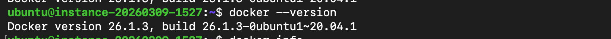 | Docker version output (Docker is installed) |
| 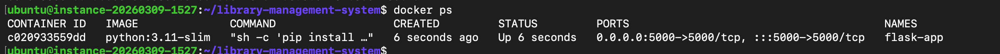 | `docker exec` into the Flask container and listing files |
| 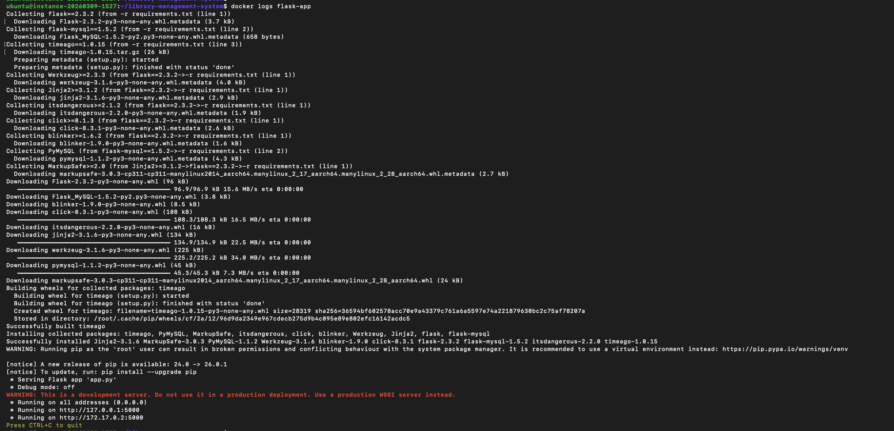 | `docker ps` showing running containers |
| 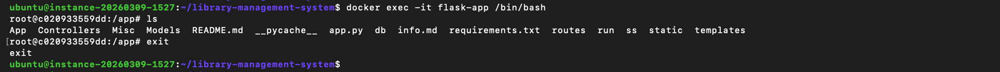 | `.dockerignore` contents |
| 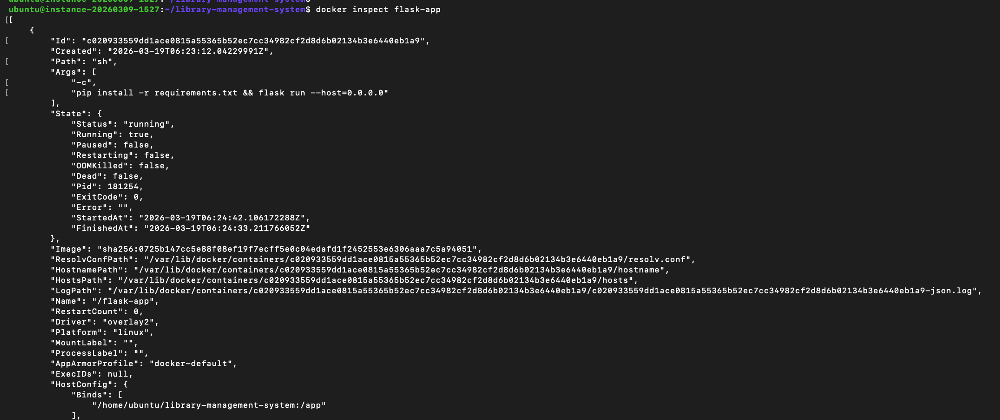 | Docker volume inspect output |
| 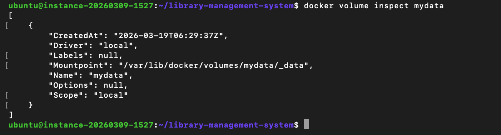 | Dockerfile content (multi-stage build) |
| 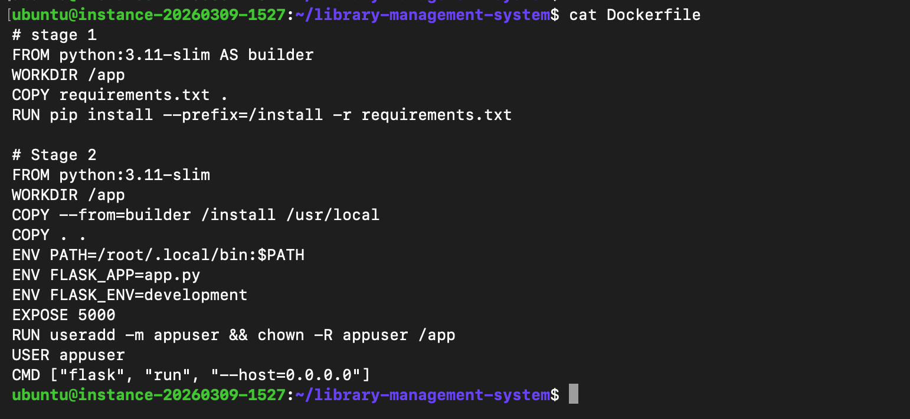 | `docker ps` showing two containers running |
| 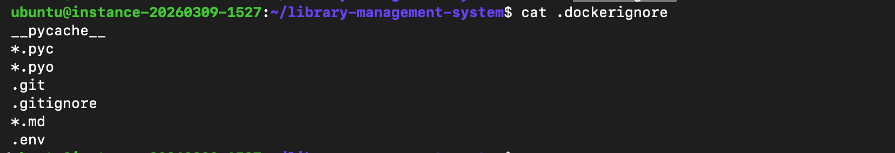 | Docker network list output |
| 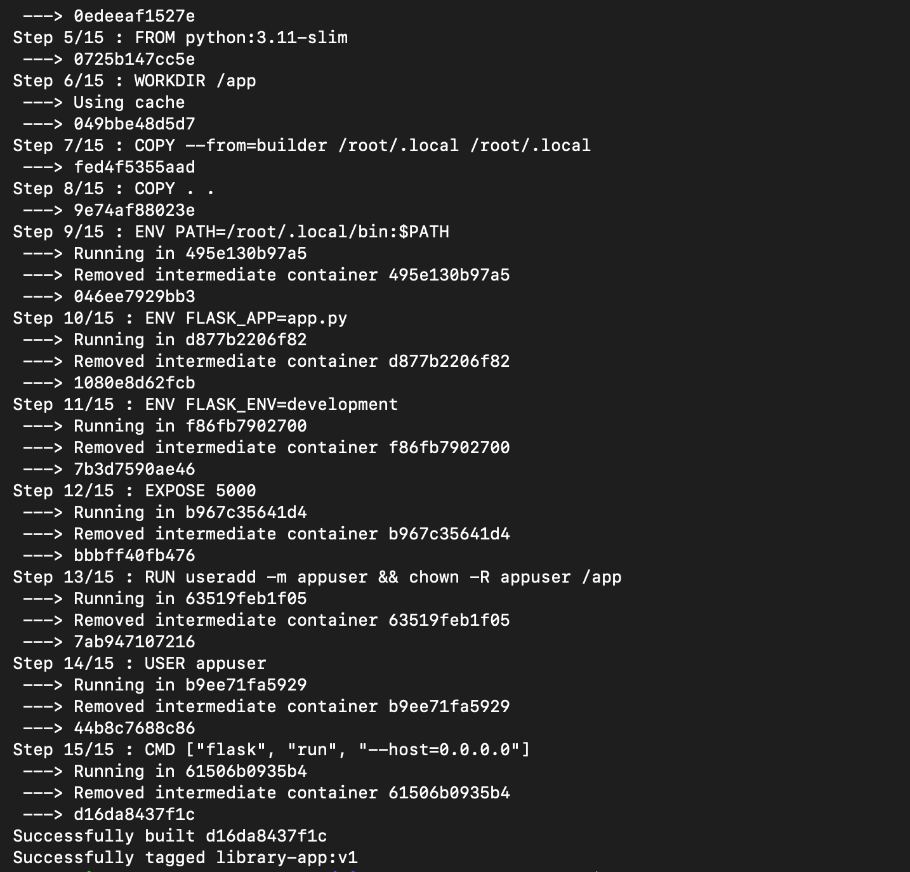 | Container pinging another container by name |
| 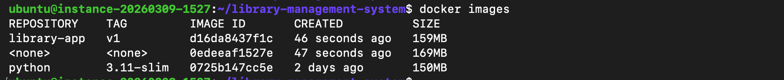 | `docker images` output showing built images |
| 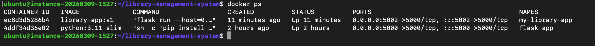 | `docker exec` network test showing DNS failure in isolated container |
| 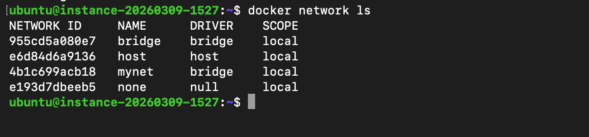 | Container inspect output showing memory/cgroup limits |
| 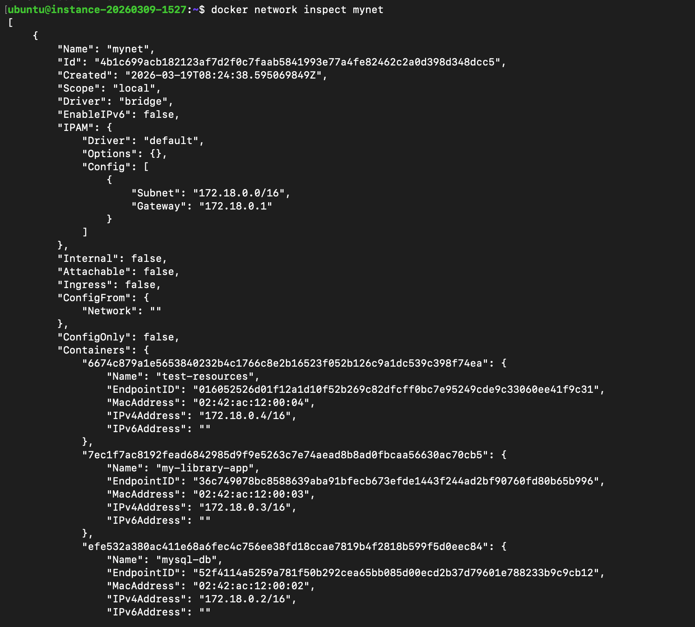 | `docker inspect` output showing bind mount to local folder |
| 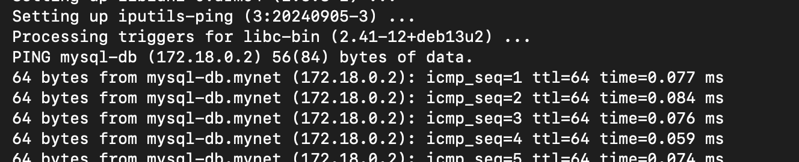 | Docker build output showing build stages |
| 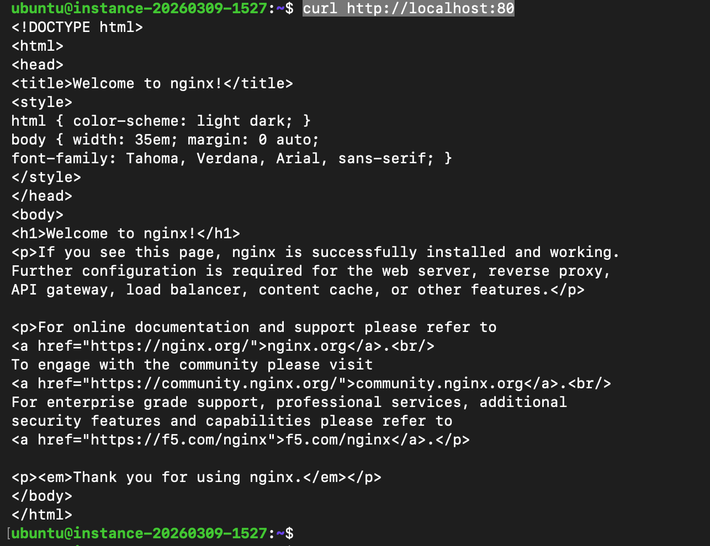 | `docker network inspect` showing container IPs on custom network |
| 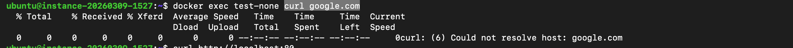 | `curl localhost:80` showing Nginx default page (host-level check) |
| 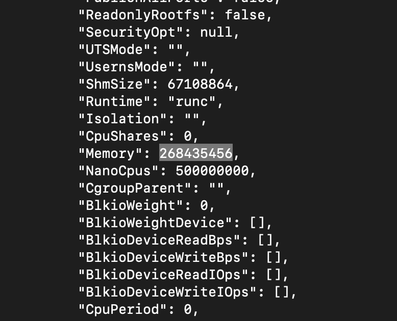 | Dependency vulnerability report (Python packages) |
| 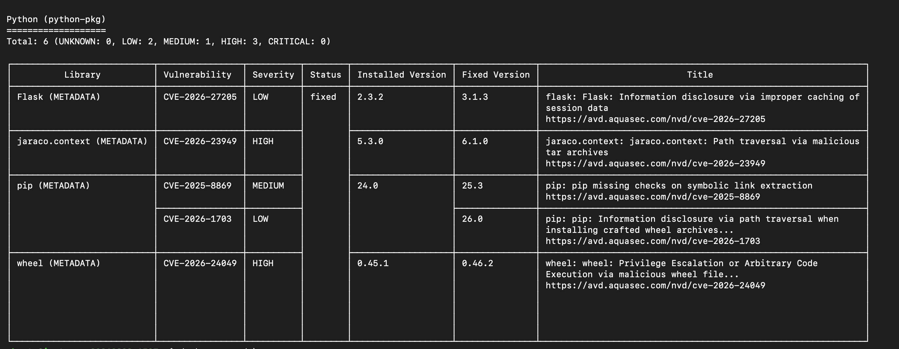 | Dependency vulnerability report (continued) |

---

## 🧪 Running the App Locally (Development)

From the `Docker-assignment` folder:

```sh
# Build the Docker image
docker build -t library-app:v1 .

# Run the container (port 5000 exposed)
docker run -d --name my-library-app -p 5000:5000 library-app:v1
```

Then open `http://localhost:5000` in your browser.

---

## 📘 Docker Concepts (Image vs Container vs Volume vs Network)

- **Image**: A read-only, versioned filesystem template built from a `Dockerfile`. Images are immutable artifacts that can be pushed/pulled from registries.
- **Container**: A running instance of an image. Containers add a writable layer on top of the image and run isolated processes.
- **Volume**: A persistent data store managed by Docker. Volumes survive container restarts and removals, and are the recommended way to keep state (databases, logs, etc.).
- **Network**: A virtual network that allows containers to communicate (and optionally connect to the host or external networks). Docker provides default networks (bridge, host, none) and supports custom user-defined networks.

---

## 🧹 Cleaning up Unused Docker Resources

Docker can accumulate images, containers, volumes, and networks over time. The following commands help reclaim disk space:

- `docker system df` — show disk usage.
- `docker container prune` — remove stopped containers.
- `docker image prune` — remove dangling images.
- `docker volume prune` — remove unused volumes.
- `docker network prune` — remove unused networks.
- `docker system prune -a` — remove all unused containers, networks, and images (use with caution).

> ⚠️ Always double-check what will be removed before running prune commands, especially in shared environments.

---

## 🔒 Best Practices for Secure Dockerfiles

- **Use minimal base images** (e.g., `python:3.11-slim`, `alpine`) to reduce the attack surface.
- **Pin versions** (e.g., `python:3.11.6-slim`) to avoid unintended changes when upstream images update.
- **Use multi-stage builds** to keep runtime images small and avoid shipping build-time dependencies.
- **Run as a non-root user** whenever possible (e.g., `USER appuser`).
- **Avoid storing secrets** in the Dockerfile or image (use build args, environment variables, or secret management solutions).
- **Limit layers** by combining commands where sensible (e.g., `RUN apt-get update && apt-get install -y ... && rm -rf /var/lib/apt/lists/*`).
- **Scan images** regularly for vulnerabilities using tools like `docker scan`, `trivy`, or `clair`.
- **Set explicit ports and health checks** (e.g., `HEALTHCHECK CMD curl -f http://localhost:5000/health || exit 1`).

---
>>>>>>> 1e1e138 (Update Docker assignment README with documentation section)
