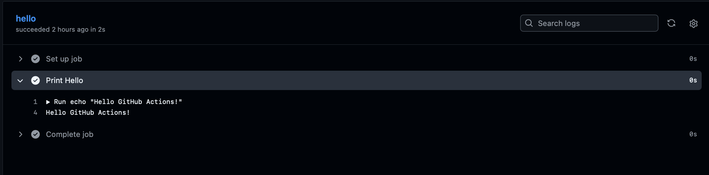
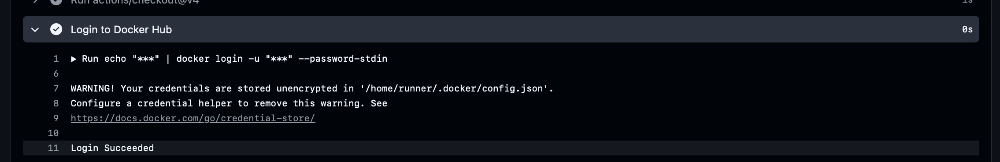
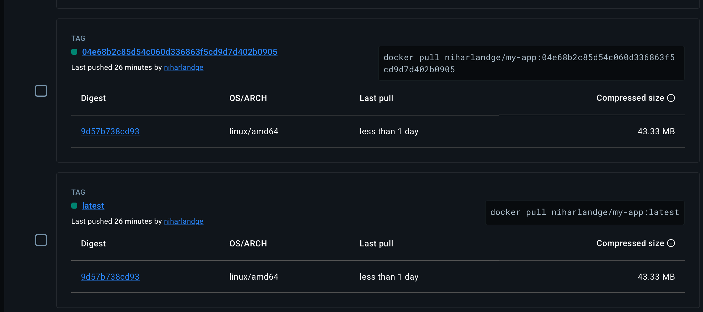
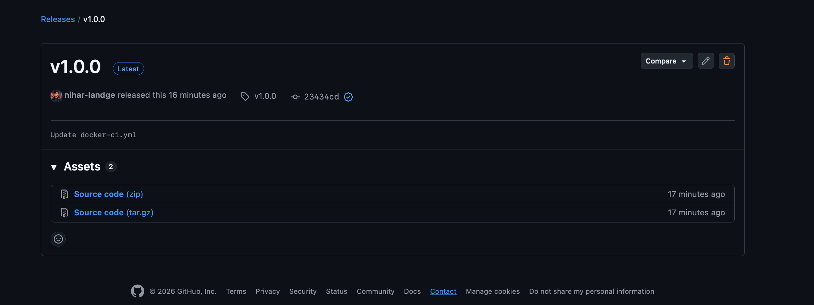
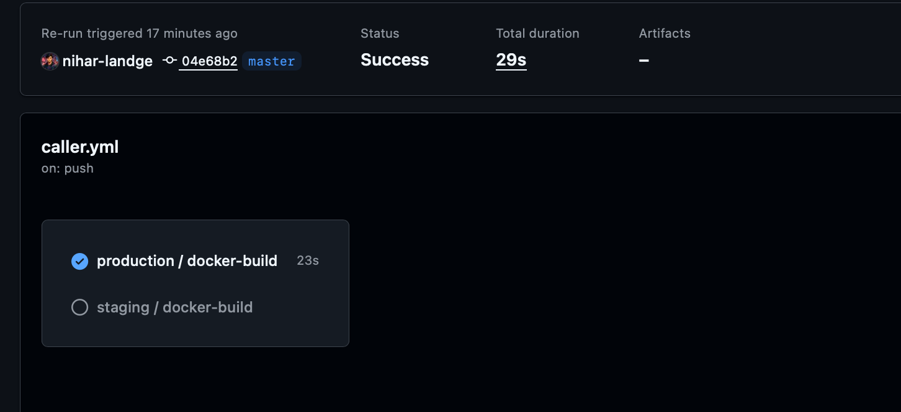
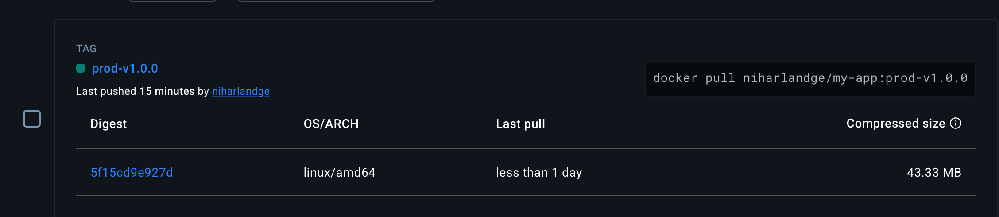
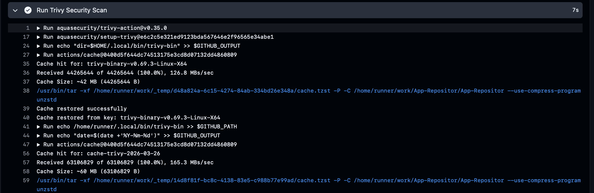
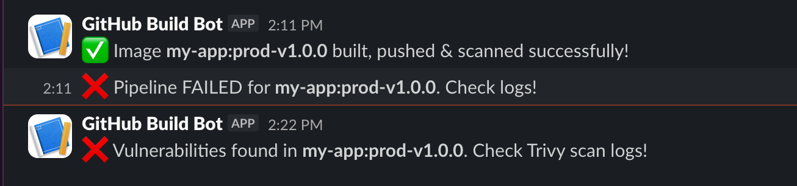

# GitHub Actions CI/CD Lab

## 📌 Overview
This lab demonstrates a progressive GitHub Actions CI/CD setup using two repositories:

| Repository | Purpose |
|---|---|
| [App-Repositor](https://github.com/nihar-landge/App-Repositor) | Contains application code, Dockerfile, and caller workflows |
| [shared-workflows](https://github.com/nihar-landge/shared-workflows) | Contains centralized reusable Docker CI/CD workflow |

---

---

## ✅ Task 1 — Hello World Workflow

**File:** `.github/workflows/hello.yml`  
**Trigger:** Push to any branch  
**Purpose:** Verify GitHub Actions is correctly set up in the repository.

```yaml
name: Hello World

on: push

jobs:
  hello:
    runs-on: ubuntu-latest
    steps:
      - name: Print Hello
        run: echo "Hello GitHub Actions!"
```

📸 **Screenshot 1:** `Actions tab → hello.yml → workflow run logs showing "Hello GitHub Actions!"`



---

## ✅ Task 2 — Basic Docker Build & Push

**File:** `.github/workflows/docker-build.yml`  
**Trigger:** Push to any branch  
**Purpose:** Automatically build and push Docker image to Docker Hub tagged
with `latest` and commit SHA.

### Secrets Configured
| Secret | Purpose |
|---|---|
| `DOCKER_USERNAME` | Docker Hub login username |
| `DOCKER_PASSWORD` | Docker Hub access token |

### Dockerfile (Multi-Stage)
```dockerfile
# Stage 1 - Build
FROM python:3.11-slim AS builder
WORKDIR /app
COPY requirements.txt .
RUN pip install --no-cache-dir -r requirements.txt

# Stage 2 - Production
FROM python:3.11-slim
WORKDIR /app
COPY --from=builder /app .
COPY . .
CMD ["python", "app.py"]
```

### Workflow
```yaml
name: Docker Build & Push

on: push

env:
  IMAGE: ${{ secrets.DOCKER_USERNAME }}/my-app

jobs:
  build:
    runs-on: ubuntu-latest
    steps:
      - uses: actions/checkout@v4
      - name: Login to Docker Hub
        run: echo "${{ secrets.DOCKER_PASSWORD }}" | docker login -u "${{ secrets.DOCKER_USERNAME }}" --password-stdin
      - name: Build Docker Image
        run: |
          docker build \
            -t $IMAGE:latest \
            -t $IMAGE:${{ github.sha }} \
            .
      - name: Push Docker Image
        run: |
          docker push $IMAGE:latest
          docker push $IMAGE:${{ github.sha }}
```

📸 **Screenshot 2:** `Actions tab → docker-build.yml → build job logs showing login, build, and push steps all green`



📸 **Screenshot 3:** `Docker Hub → your repository → showing both tags: latest and commit SHA`



---

## ✅ Task 3 — Shared Workflow Repository & Release

**Purpose:** Centralize Docker CI in one reusable workflow stored in
`shared-workflows` repo. App repo calls it via release tag.

### Reusable Workflow (shared-workflows repo)
**File:** `.github/workflows/docker-ci.yml`  
**Trigger:** `workflow_call` with inputs `image_name` and `tag`

### Caller Workflow (App-Repositor)
**File:** `.github/workflows/caller.yml`

| Branch | Docker Image Tag |
|---|---|
| `develop` | `staging-<commit_sha>` |
| `master` | `prod-v1.0.0` |

```yaml
name: Caller Workflow

on:
  push:
    branches:
      - master
      - develop

jobs:
  staging:
    if: github.ref == 'refs/heads/develop'
    uses: nihar-landge/shared-workflows/.github/workflows/docker-ci.yml@v1.0.0
    with:
      image_name: my-app
      tag: staging-${{ github.sha }}
    secrets:
      DOCKER_USERNAME: ${{ secrets.DOCKER_USERNAME }}
      DOCKER_PASSWORD: ${{ secrets.DOCKER_PASSWORD }}
      SLACK_WEBHOOK: ${{ secrets.SLACK_WEBHOOK }}

  production:
    if: github.ref == 'refs/heads/master'
    uses: nihar-landge/shared-workflows/.github/workflows/docker-ci.yml@v1.0.0
    with:
      image_name: my-app
      tag: prod-v1.0.0
    secrets:
      DOCKER_USERNAME: ${{ secrets.DOCKER_USERNAME }}
      DOCKER_PASSWORD: ${{ secrets.DOCKER_PASSWORD }}
      SLACK_WEBHOOK: ${{ secrets.SLACK_WEBHOOK }}
```

📸 **Screenshot 4:** `shared-workflows repo → Releases tab → showing v1.0.0 published`



📸 **Screenshot 5:** `App-Repositor → Actions tab → caller.yml → workflow run showing production or staging job succeeded`



📸 **Screenshot 6:** `Docker Hub → showing staging-<sha> or prod-v1.0.0 tag pushed`



---

## ✅ Task 4 — Security Scanning & Slack Notifications

**Purpose:** Scan Docker image for vulnerabilities using Trivy and send
Slack notifications on success or failure.

### Secrets Added
| Secret | Purpose |
|---|---|
| `SLACK_WEBHOOK` | Incoming webhook URL from Slack app |

### How It Works


### Trivy + Slack Steps in `docker-ci.yml`
```yaml
- name: Run Trivy Security Scan
  id: trivy
  uses: aquasecurity/trivy-action@v0.35.0
  continue-on-error: true
  with:
    image-ref: ${{ secrets.DOCKER_USERNAME }}/${{ inputs.image_name }}:${{ inputs.tag }}
    severity: HIGH,CRITICAL
    exit-code: 1

- name: Slack Notify Success
  if: success() && steps.trivy.outcome == 'success'
  run: |
    curl -X POST "${{ secrets.SLACK_WEBHOOK }}" \
      -H 'Content-type: application/json' \
      --data "{\"text\":\"✅ Image *${{ inputs.image_name }}:${{ inputs.tag }}* built, pushed & scanned successfully!\"}"

- name: Slack Notify Failure
  if: steps.trivy.outcome == 'failure'
  run: |
    curl -X POST "${{ secrets.SLACK_WEBHOOK }}" \
      -H 'Content-type: application/json' \
      --data "{\"text\":\"❌ Vulnerabilities found in *${{ inputs.image_name }}:${{ inputs.tag }}*. Check Trivy scan logs!\"}"
```

📸 **Screenshot 7:** `Actions tab → caller.yml run → Trivy scan step logs showing scan output`



📸 **Screenshot 8:** `Slack channel → showing success notification message with image name and tag`



---

## ✅ Task 5 — Documentation

Full documentation is available in [LAB-NOTES.md](./LAB-NOTES.md)

---

## 🔐 Secrets Summary

All secrets are configured in repository **Settings → Secrets and variables → Actions**

| Secret | Used In | Purpose |
|---|---|---|
| `DOCKER_USERNAME` | App-Repositor | Docker Hub login |
| `DOCKER_PASSWORD` | App-Repositor | Docker Hub access token |
| `SLACK_WEBHOOK` | App-Repositor | Slack incoming webhook URL |

---
