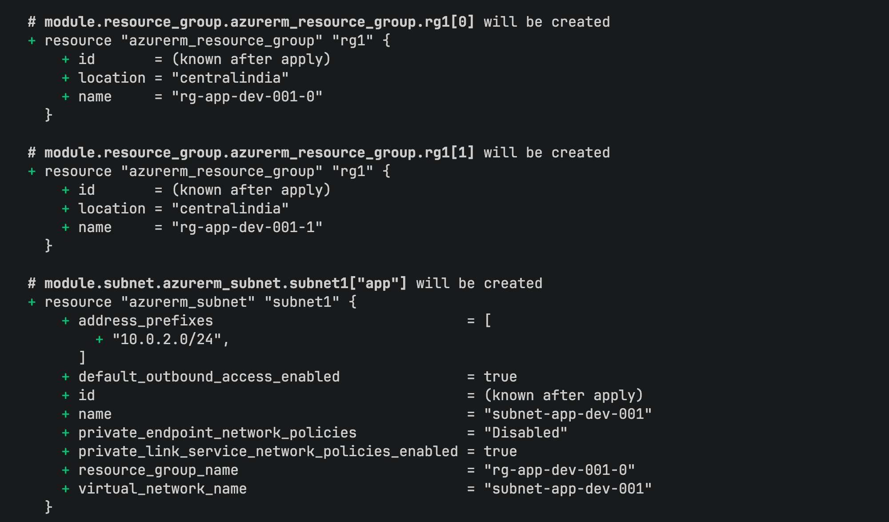
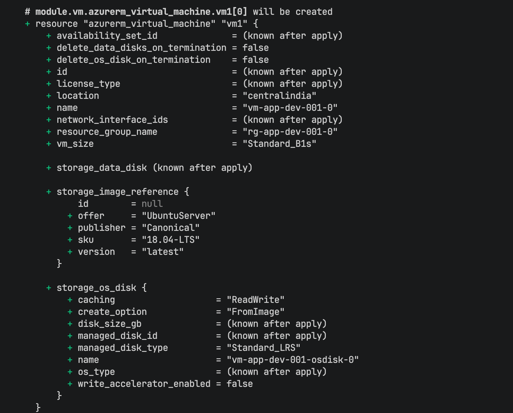
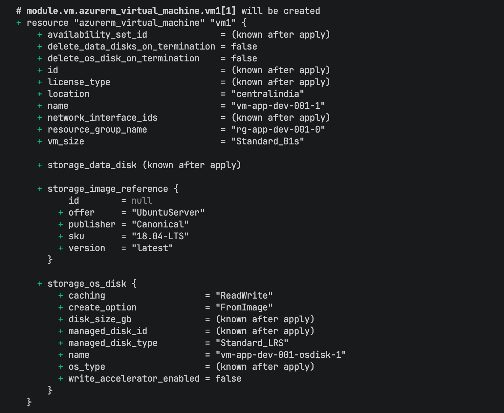
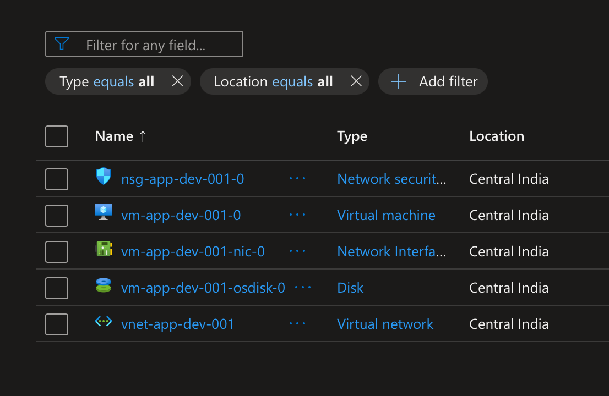

# Azure Infrastructure Provisioning with Terraform

This project demonstrates the provisioning of a modularized Azure infrastructure using Terraform. The project follows best practices including resource modularization, standardized naming conventions, use of loops (`count`, `for_each`), and separating configurations into specific files (`main.tf`, `variables.tf`, `locals.tf`, `outputs.tf`).

## Architecture & Modules

The infrastructure is broken down into the following Terraform modules:
- **1_resource_group**: Manages Azure Resource Groups.
- **2_vnet**: Manages Virtual Networks.
- **3_subnet**: Manages Subnets within the Virtual Network.
- **4_nsg**: Manages Network Security Groups and rules.
- **5_vm**: Manages Virtual Machines and associated Network Interfaces (NICs).

---

## Tasks Performed & Screenshot Placeholders

Here is the breakdown of the implemented features along with where to attach screenshots for documentation:

### 1. Terraform Execution (Init, Plan, Apply)
Modules are called in the root `main.tf` and deployed.
- **  **
- **      **
- **   **

### 2. Standardized Resource Naming using Locals
Resource namings follow the structure `<prefix>-<name>-<env>-001` (e.g., `rg-app-dev-001`). This was achieved utilizing the `locals.tf` block and the `format()` function.
- **  **

### 3. Meta-Arguments: `count` and `for_each`
- `count` is utilized for deploying multiple instances of Resource Groups and Virtual Machines.
- `for_each` is utilized for iterating over maps to deploy Virtual Networks and Subnets (e.g., `web`, `app`, `db` subnets).
- **  **

### 4. Terraform Functions
Leveraged various Terraform built-in functions such as `format()`, map/list lookups, and iteration logic to dynamically assign values.
- **[Add Screenshot Here: Code snippet highlighting the `format()` function in `locals.tf` or `main.tf`]**

### 5. Lifecycle Management
Implemented `lifecycle` blocks (such as `prevent_destroy` and `create_before_destroy`) to protect critical resources and ensure zero-downtime deployments.
- ** **

---