# Git & NGINX Assessment
**Author:** Nihar Landge  
**Repo:** git-nginx-assessment

---

## P1 — Git Setup & First Repo
- Installed Git and configured global identity
- Initialized repo, created README.md and app.py
- Staged and committed with message: `Initial commit: add README and app.py`
     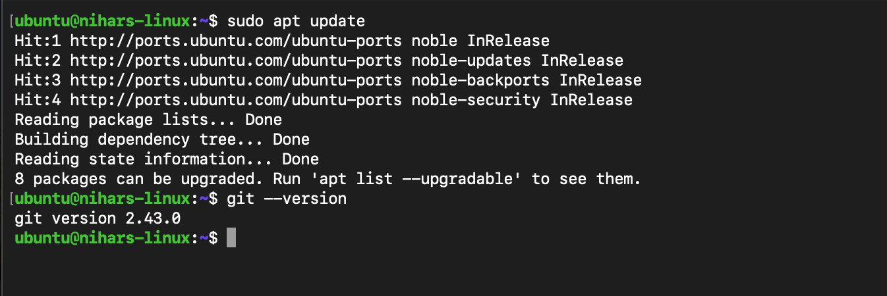
     
     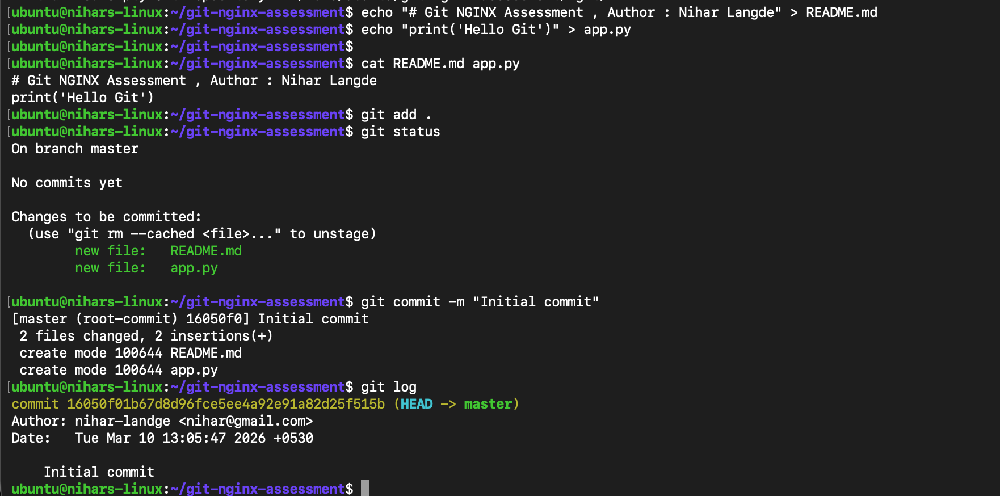

---

## P2 — Branching & Pull Request
- Created branch `feature/add-calculator`
- Added `calculator.py` with `add()` and `subtract()` functions
- Opened PR on GitHub, merged into master

     
     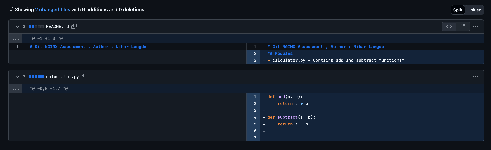

---

## P3 — Stash, Revert, Reset & Amend
- Used `git stash` and `git stash pop` on `bugfix/stash-demo`
- Reverted a bad commit using `git revert`
- Fixed commit message using `git commit --amend`
- Used `git reset --soft HEAD~1` to un-commit while keeping changes staged

     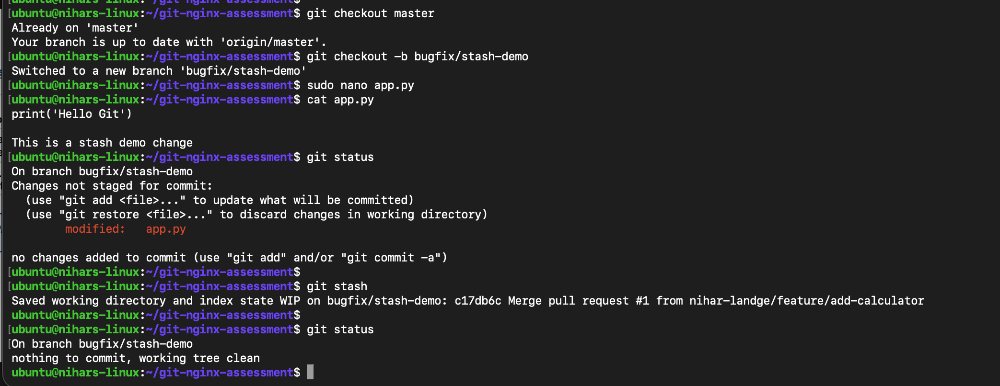
     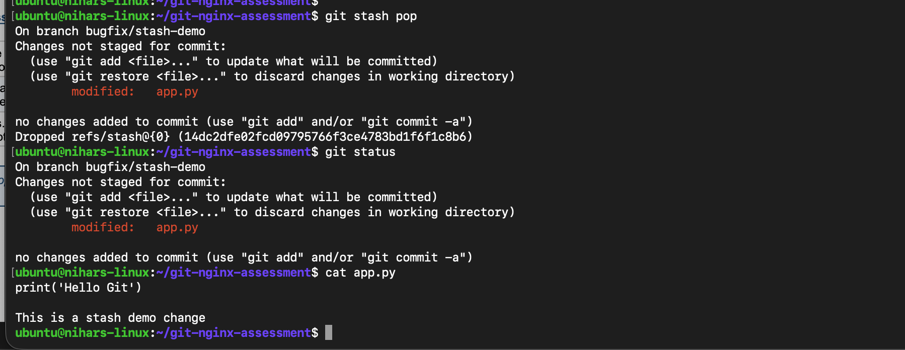
     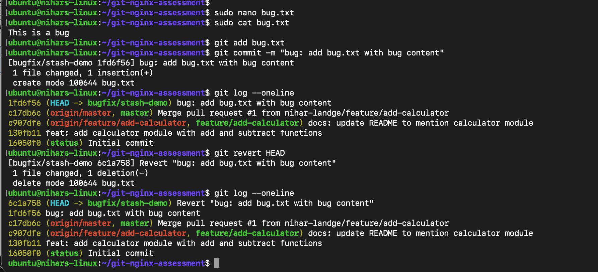
     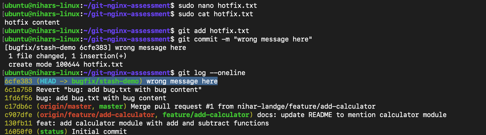
     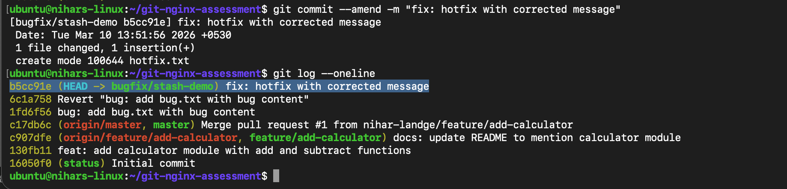
     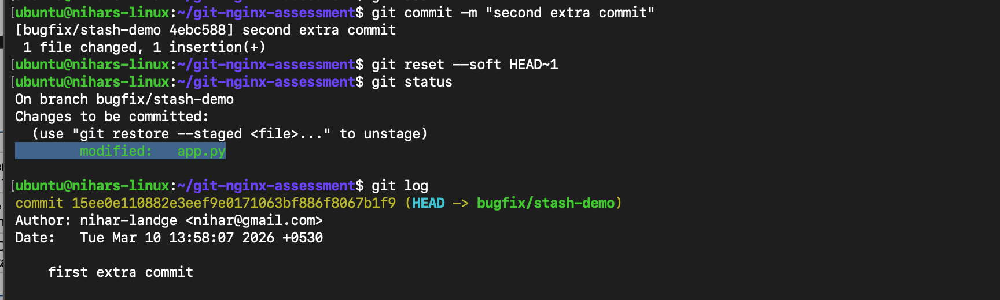

---

## P4 — NGINX Static Hosting
- Installed NGINX on Ubuntu
- Hosted `app1.local` and `app2.local` with unique HTML pages
- Configured server blocks in `sites-available`, enabled via symlinks

     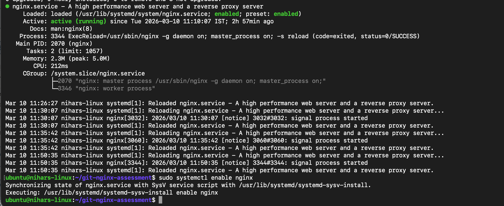
     
     

---

## P5 — Reverse Proxy with Docker
- Ran `nginx:alpine` container as backend on port 8080
- Configured NGINX `proxy_pass` to forward requests to Docker backend
- All 4 proxy headers set: `Host`, `X-Real-IP`, `X-Forwarded-For`, `X-Forwarded-Proto`

     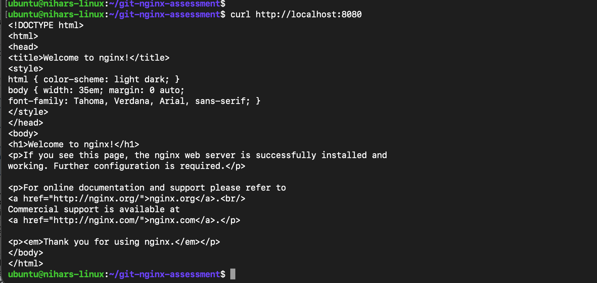
     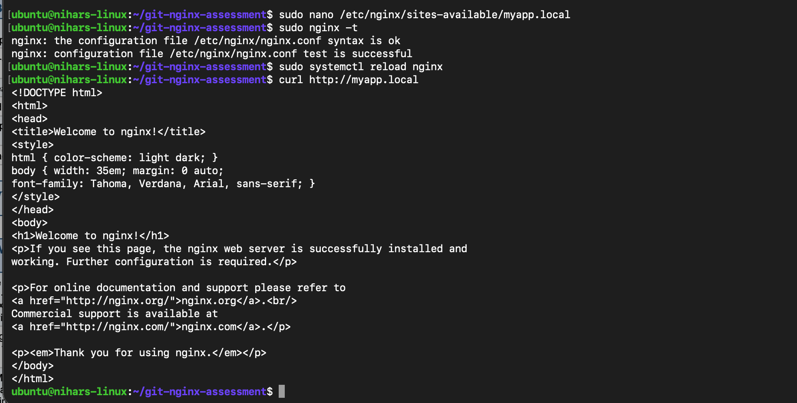

---

## P6 — SSL & Load Balancing
- Generated self-signed SSL cert using `openssl`
- Configured NGINX to listen on port 443 with SSL
- Set up upstream load balancer block with two backend entries

     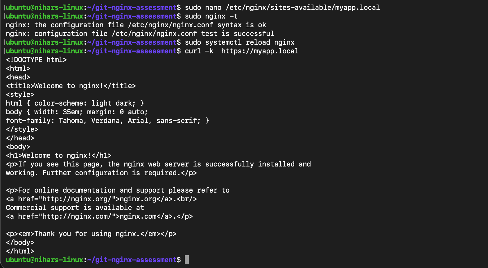
     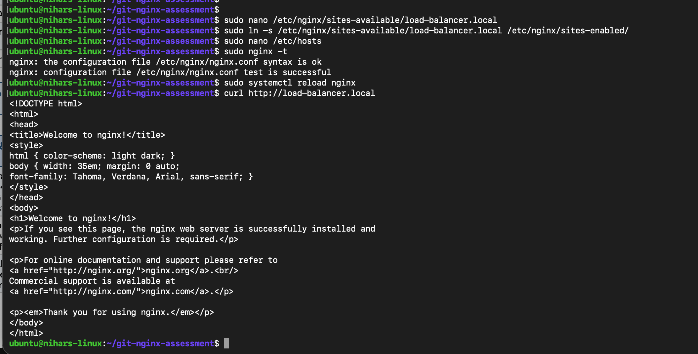

---

## Short Answers
*(Add Q1–Q10 answers here)*

## Short Answers

## Short Answers

### Q1 — git revert vs git reset --hard

`git revert` undoes a commit by creating a 'new commit' that reverses the
changes, keeping the full history intact. 
`git reset --hard` moves the branch
pointer back and permanently deletes all changes — they cannot be recovered.

---

### Q2 — Three Areas of Git

Git has three areas: **Working Directory**, **Staging Area**, and **Repository**.

---

### Q3 — Merge Conflicts & Resolution

A merge conflict happens when two branches modify the **same line of a file**
independently and Git cannot decide which change to keep. Git marks the
conflicting sections using conflict markers: `<<<<<<< HEAD` (your changes),
`=======` (divider), and `>>>>>>> branch-name` (incoming changes). 
To resolve
it, open the file, manually keep the correct content, and remove all conflict
markers. Then run `git add <file>` to mark it resolved and `git commit` to
complete the merge.

---

### Q4 — Purpose of .gitignore

The `.gitignore` file tells Git which files and folders to **never track or
commit**. This keeps sensitive, temporary, or auto-generated files out of the
repository. In a project `.env` are commonly ignored
— `.env` contains secret keys and credentials
that must never be pushed to a public repository.

---

### Q5 — git merge vs git rebase

`git merge` combines two branches by creating a **merge commit**, preserving the
full history of both branches exactly as it happened. `git rebase` moves your
branch commits on top of another branch, creating a **linear history** with no
merge commits. The main advantage of rebase is a cleaner, easier-to-read commit
history. However, you should never rebase commits that have already been pushed
to a shared branch, as it rewrites history and causes problems for other
developers.

---

### Q6 — NGINX Event-Driven vs Apache Thread-per-Connection

NGINX uses an **asynchronous, event-driven architecture** where a small fixed
number of worker processes handle thousands of connections simultaneously using
non-blocking I/O. Apache uses a **thread-per-connection model** where each
request gets its own thread or process, consuming more memory as traffic grows.
For high-concurrency workloads (thousands of simultaneous requests), NGINX is
far more efficient because it does not create a new thread for every connection.
This makes NGINX the preferred choice for modern high-traffic APIs and web
applications.

---

### Q7 — sites-available vs sites-enabled

`sites-available` stores **all** NGINX site configuration files, whether active
or not. `sites-enabled` contains only **symlinks** pointing to the configs in
`sites-available` that are currently active. The symlink approach is used because
it lets you enable or disable a site instantly (`ln -s` to enable, `rm` to
disable) without deleting or editing the config file. This makes it safe and
easy to toggle sites on and off without losing any configuration.

---

### Q8 — Reverse Proxy & Why Use NGINX in Front of Docker

A reverse proxy is a server that **receives client requests and forwards them**
to a backend application, then returns the response to the client. Placing NGINX
in front of a Node.js or Python app running in Docker means the app container is
never exposed directly on port 80/443 — NGINX handles all incoming traffic,
SSL termination, logging, and header management centrally. This improves
security, allows multiple apps to share the same port, and makes it easy to
add load balancing or caching without changing the app itself.

---

### Q9 — SSL Termination vs SSL Passthrough

In **SSL termination**, the load balancer (NGINX) decrypts the HTTPS traffic and
forwards plain HTTP to the backend servers — only one certificate is needed on
the load balancer. In **SSL passthrough**, the load balancer forwards encrypted
traffic directly to backends, and each backend must handle its own TLS
decryption with its own certificate. SSL termination is preferred for most
applications because backends receive plain HTTP with no CPU overhead for
decryption, and the load balancer can inspect, log, and modify requests. SSL
passthrough is used only when end-to-end encryption compliance is required
(e.g., PCI DSS strict mode).

---

### Q10 — try_files $uri $uri/ =404

The `try_files $uri $uri/ =404` directive tells NGINX to check for a file or
directory in a specific order before returning an error. For a request to
`/about`, NGINX first looks for an **exact file** at the root path (`/about`),
then checks if a **directory** named `/about/` exists with an index file, and
finally returns a **404 error** if neither is found. This is the standard pattern
for static sites because it handles both direct file requests and directory-based
routing cleanly without unnecessarily passing requests to a backend.
