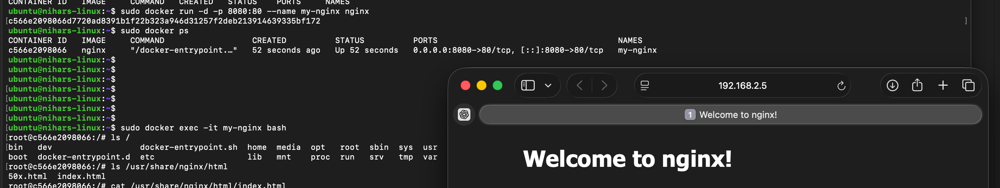
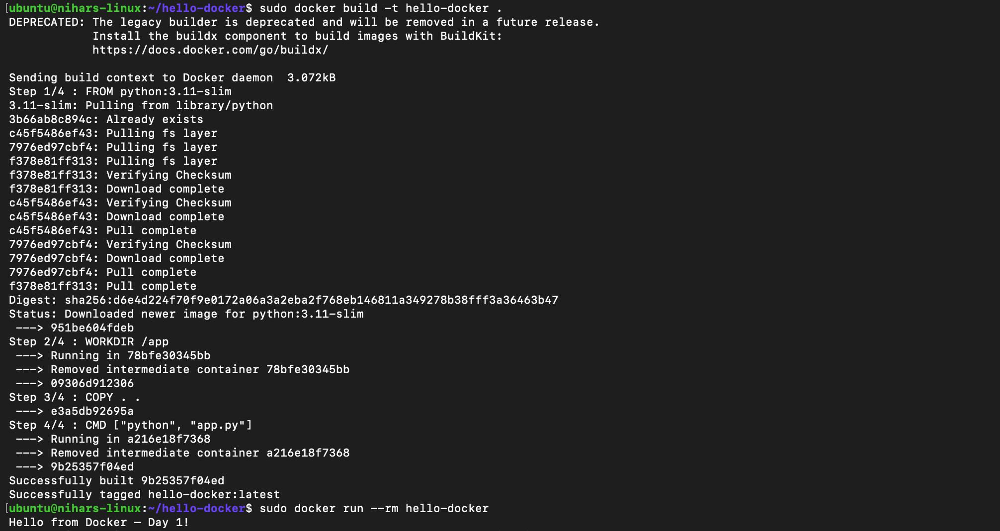
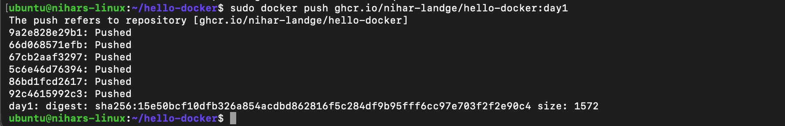

# Day 1 - Docker Basics

## What I Learned
Docker is an open-source platform that packages applications and dependencies into lightweight containers for consistent deployment across environments. Containers share the host OS kernel, making them faster and more efficient than VMs. Key benefits include eliminating "works on my machine" issues, faster deployments, and simplified DevOps workflows.


## Containers vs VMs

**Containers**
- Shares the OS kernel (i.e., lightweight so if we run multiple containers, they're also lightweight)
- Takes seconds to boot
- Low resource usage

**VMs**
- They have Guest OS; if there are multiple VMs, then Multiple Guest OS on the Parent OS
- Takes minutes to boot
- High RAM/Disk usage 

## Docker Commands

```bash
docker version # Check Docker installation
docker images  # List local images
docker ps       # List running containers
docker ps -a    # List all containers
docker pull <image>  # Download image from registry
docker run <image>   # Create + start container
docker run -d -p 8080:80 --name my-nginx nginx  # Background + port mapping
docker exec -it <container> bash  # Shell inside running container
docker stop <container>  # Stop running container
docker rm <container>    # Remove stopped container
docker build -t <name> . # Build image from Dockerfile
```


## Practical Examples

### Nginx Container Running
**What it shows**: Nginx container running on port 8080




### Hello-Docker Build
**What it shows**: Building my first custom image



### GHCR Push Success
**What it shows**: First image pushed to GitHub Container Registry




## GHCR (GitHub Container Registry)

### What is GHCR?
GHCR (`ghcr.io`) stores Docker images in GitHub, integrated with repos and GitHub Actions for CI/CD. Images follow format:
```bash
ghcr.io/nihar-landge/hello-docker:day1
```
