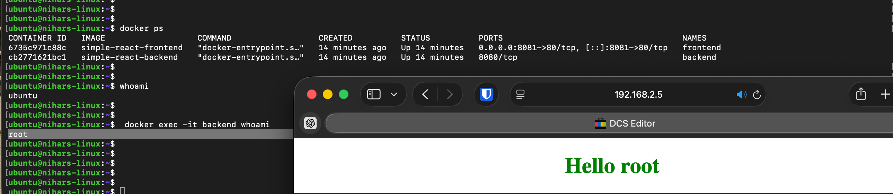

# Simple React Full Stack — Dockerized

Dockerized version of [crsandeep/simple-react-full-stack](https://github.com/crsandeep/simple-react-full-stack).
Two separate containers (frontend + backend) connected via Docker network with Nginx as reverse proxy.

## Architecture

```text
Browser → Nginx Container (Port 80) → React static files
          ↓ /api/*
          Express Container (Port 8080)
```


## Project Structure

```text
├── src/
│   ├── client/    → React frontend
│   └── server/    → Express backend
├── Dockerfile.backend  → Express container
├── Dockerfile.frontend → Nginx + React container
└── nginx.conf          → Reverse proxy config
```


## How to Run

```bash
# Create network
docker network create app-network

# Build images
docker build -f Dockerfile.backend -t simple-react-backend .
docker build -f Dockerfile.frontend -t simple-react-frontend .

# Run containers
docker run -d --name backend --network app-network simple-react-backend
docker run -d --name frontend --network app-network -p 8081:80 simple-react-frontend
```

## Access

- **React App**: http://localhost:8081
- **Express API**: http://localhost:8081/api/getUsername

## How It Works

- **Backend**: Express runs on port 8080 (internal only, not exposed to host)
- **Frontend**: Nginx serves React build files and proxies `/api` requests to backend container
- **Networking**: Both containers on `app-network`, Nginx reaches backend using `http://backend:8080`


## GHCR Images

```bash
docker pull ghcr.io/nihar-landge/simple-react-backend:latest
docker pull ghcr.io/nihar-landge/simple-react-frontend:latest
```




## User Context Comparison

| Environment | Command | Output |
|-------------|---------|--------|
| Ubuntu Host | `whoami` | `ubuntu` |
| Docker Container (backend) | `whoami` | `root` (default Docker user) |
