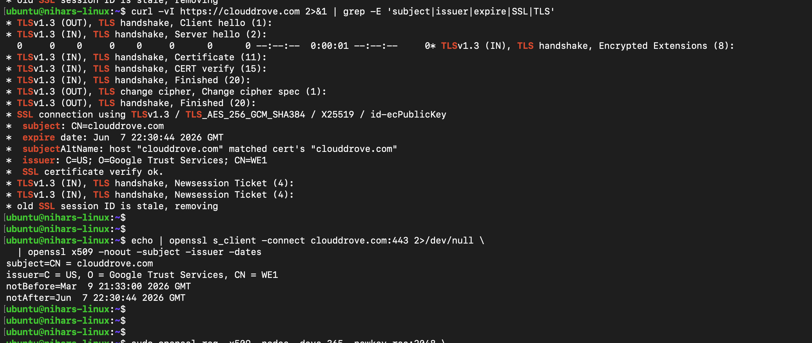
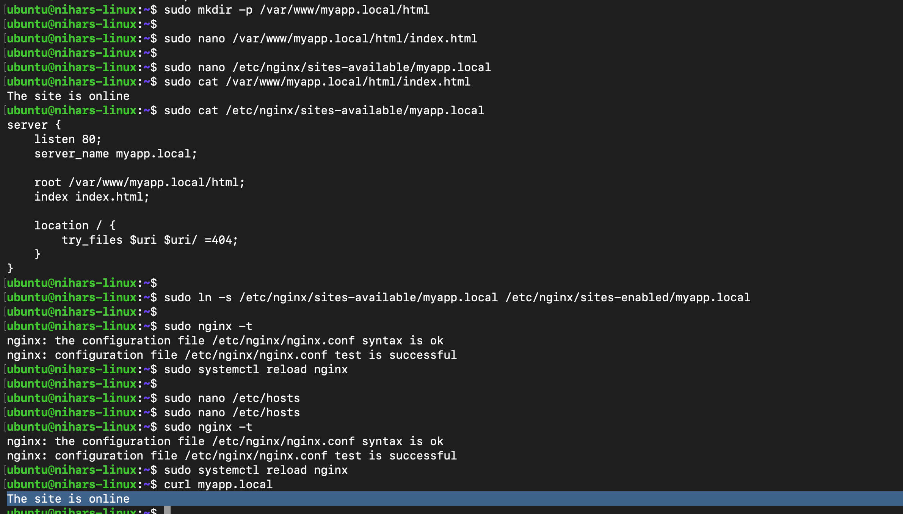
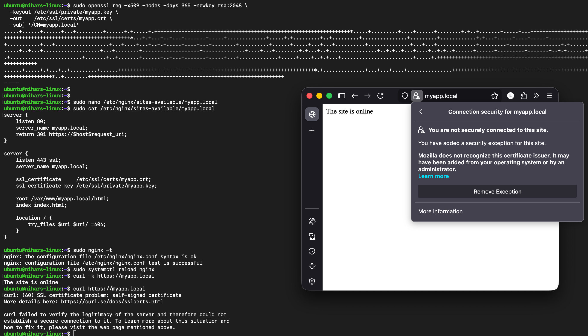
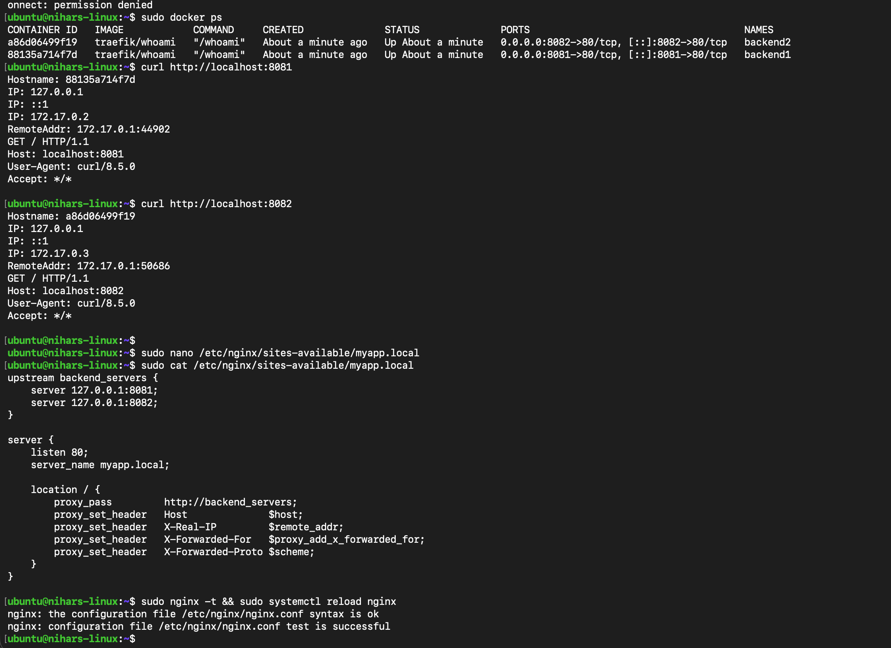
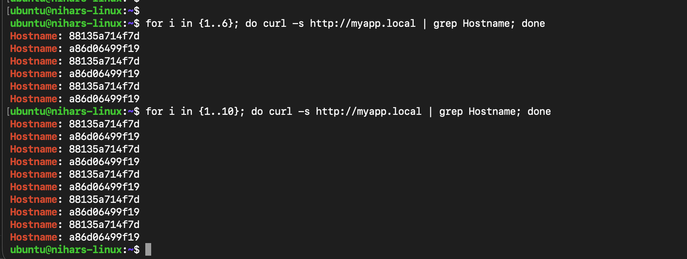

# Day 4 - Nginx Tasks

## T1 - Inspect a live TLS certificate

- Checked certificate issuer, subject, and expiry date.
- Verified certificate key type and size.

Screenshots:

## T2 - Self-signed certificate for local domain

- Created a self-signed certificate for `myapp.local`.
- Configured Nginx to serve HTTPS on port `443`.

Screenshot:

Here I maped my multipass vm ip to `myapp.local` in my laptop so i can access it through my Browser

## T3 - Nginx load balancing with Docker backends

- Started two backend containers.
- Configured Nginx upstream and tested round-robin responses.

Screenshots:

