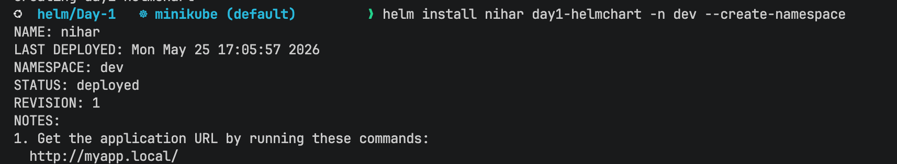
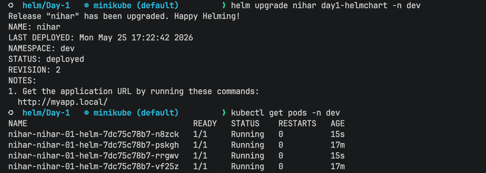
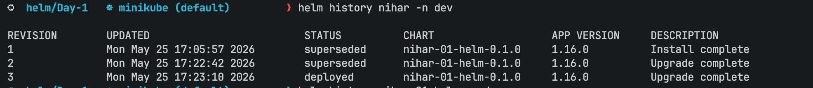
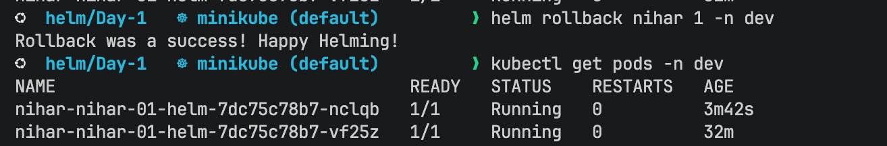
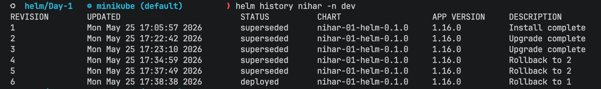

# Helm Hands on

- Installed the chart in the `dev` namespace using:

- make the Changes in replicas initialy it was 1 and then I make it 4

- checked the helm history of revisions 

- rollback to different versions and checked the pods.

