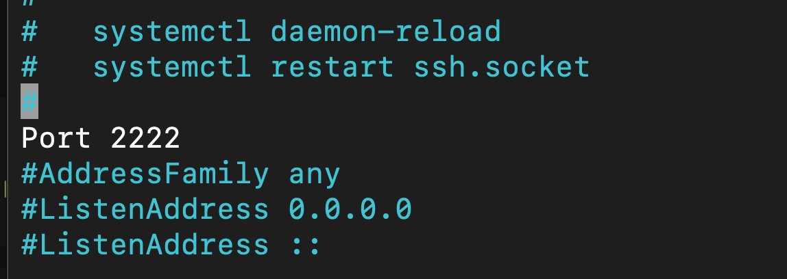
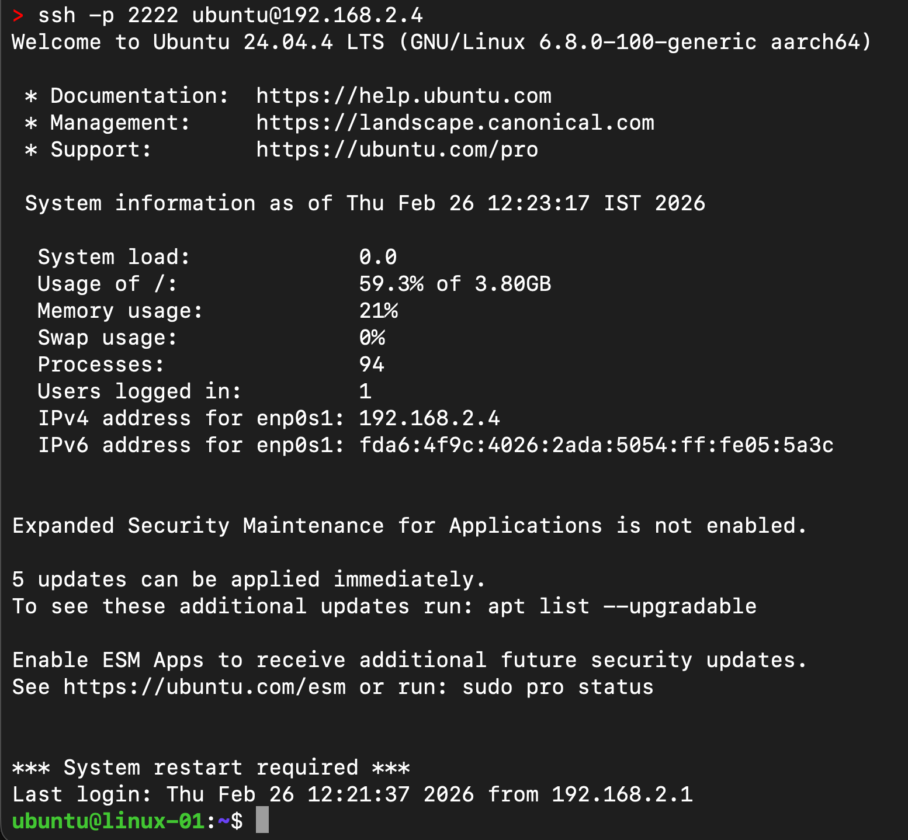
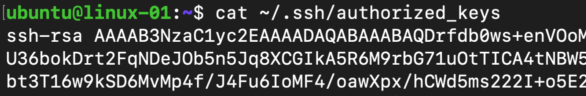
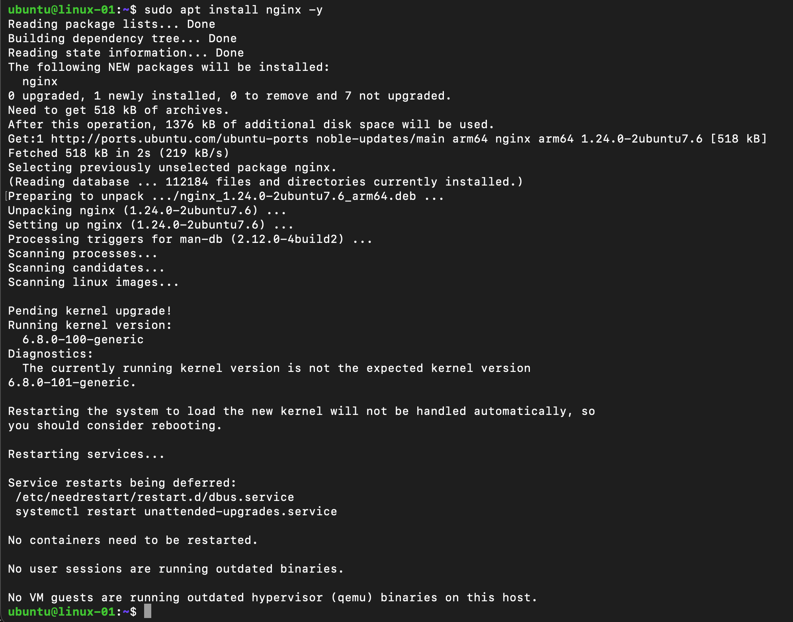
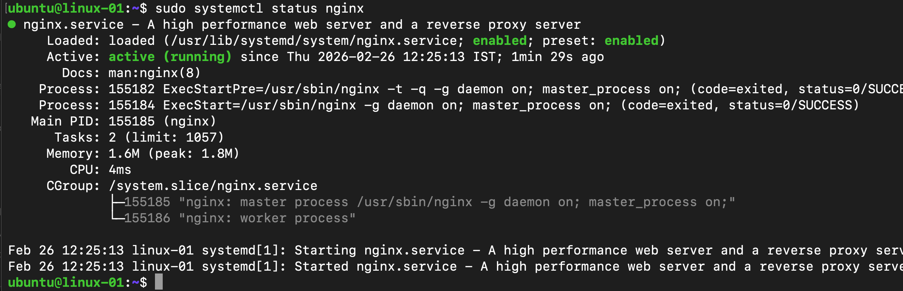
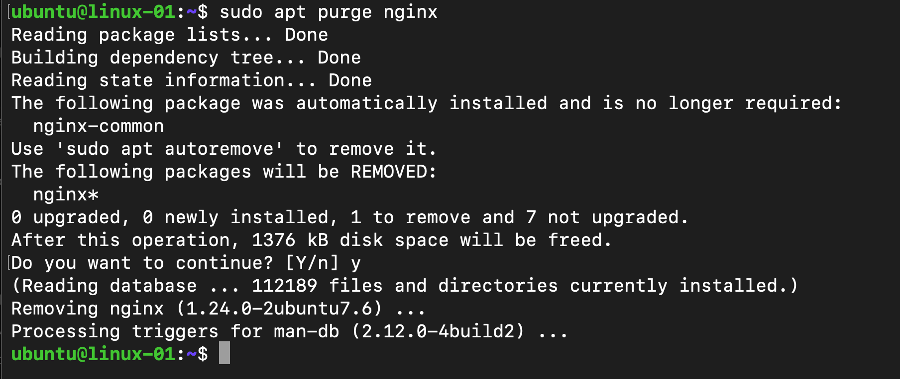
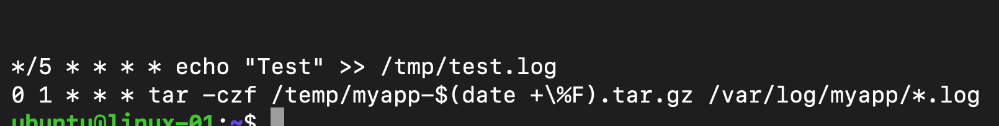
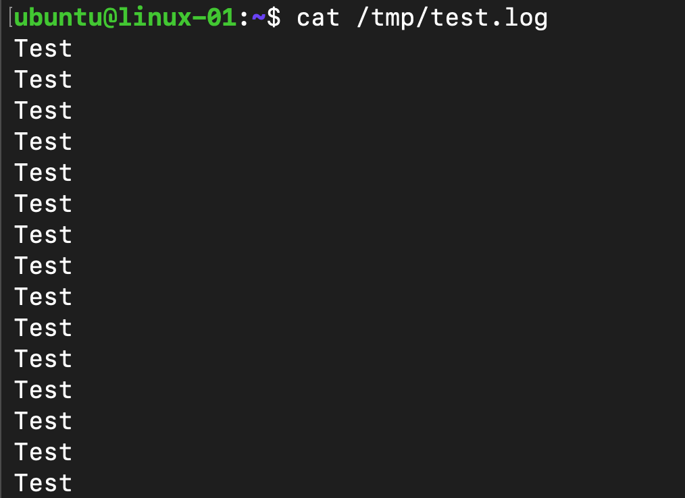
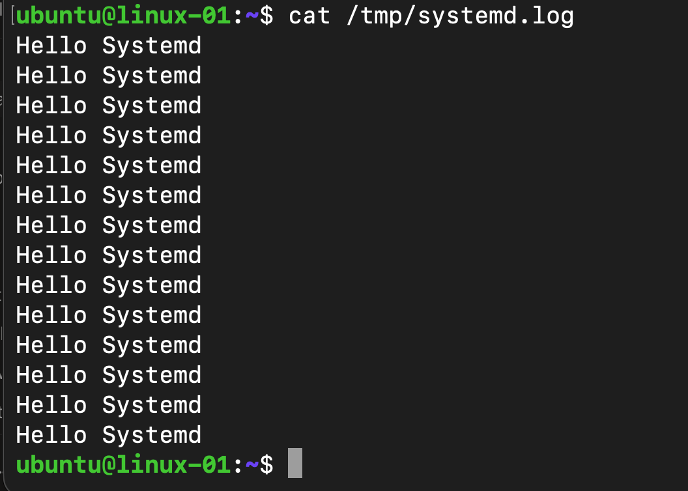

# Day 2 - Linux: SSH, Package Management, Cron & systemd

**Environment:** Mac + Multipass Ubuntu VM

---

## 1. SSH Hardening

- Generated SSH key pair on Mac
- Injected public key into VM
- Disabled password login & root login
- Changed SSH port 22 → 2222
- Fixed systemd socket override issue










---

## 2. Package Management

- Updated package list with `apt update`
- Installed nginx, verified status, removed it
- Listed packages with `dpkg -l`








---

## 3. Cron Job Scheduling

- Cron job runs every 5 minutes → writes to test.log
- Daily job at 1 AM → archives logs with tar





---

## 4. systemd Service & Timer

- Created `disk_check.sh` script
- Created service + timer unit files
- Timer runs every 5 minutes
- Verified with `systemctl list-timers`




---

## 5. Homework - Log Archive

- Created `/var/log/myapp/` with sample log file
- Archived logs using tar with date in filename

```bash
tar -czf /tmp/myapp-$(date +%F).tar.gz /var/log/myapp/*.log
```

