# 🌍 Terraform Day-1 

### 1. Install Terraform on System
- Downloaded and installed Terraform on the system.
- Verified installation using `terraform version`.

> 📸 Screenshot: 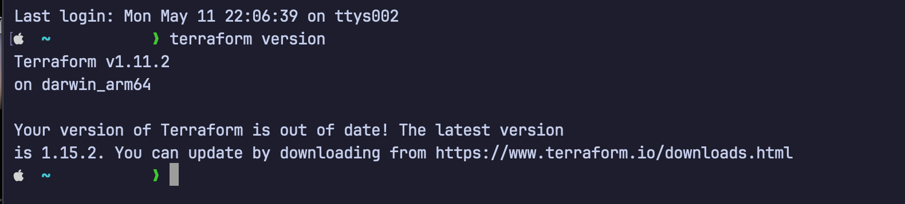
---

### 2. Set Up Alias in bash/zsh
- Added alias for terraform in / `.zshrc`:
```bash
alias tf="terraform"
```

> 📸 Screenshot: 
> 📸 Screenshot: 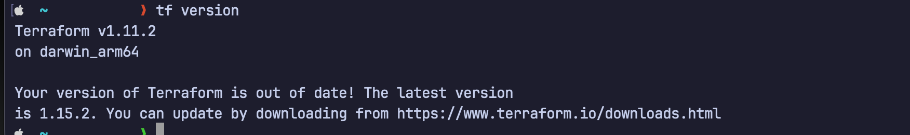
---

### 3. Deploy and Destroy First Resource
- Copied an example configuration from [Terraform Registry](https://registry.terraform.io/).
- Ran:
```bash
terraform init
terraform apply
terraform destroy
```
> 📸 Screenshot: 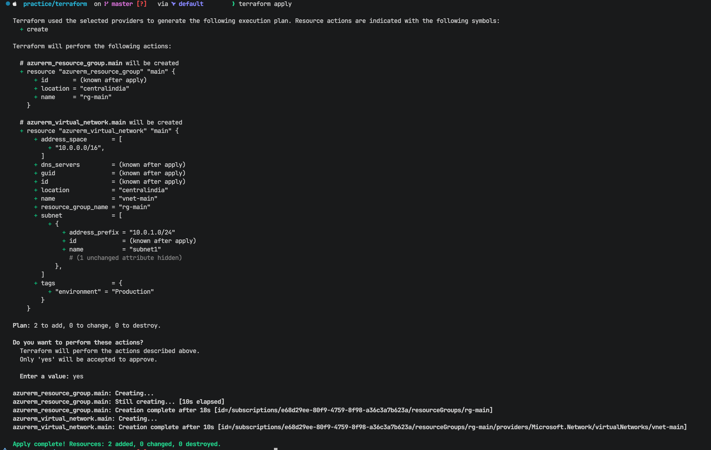
> 📸 Screenshot: 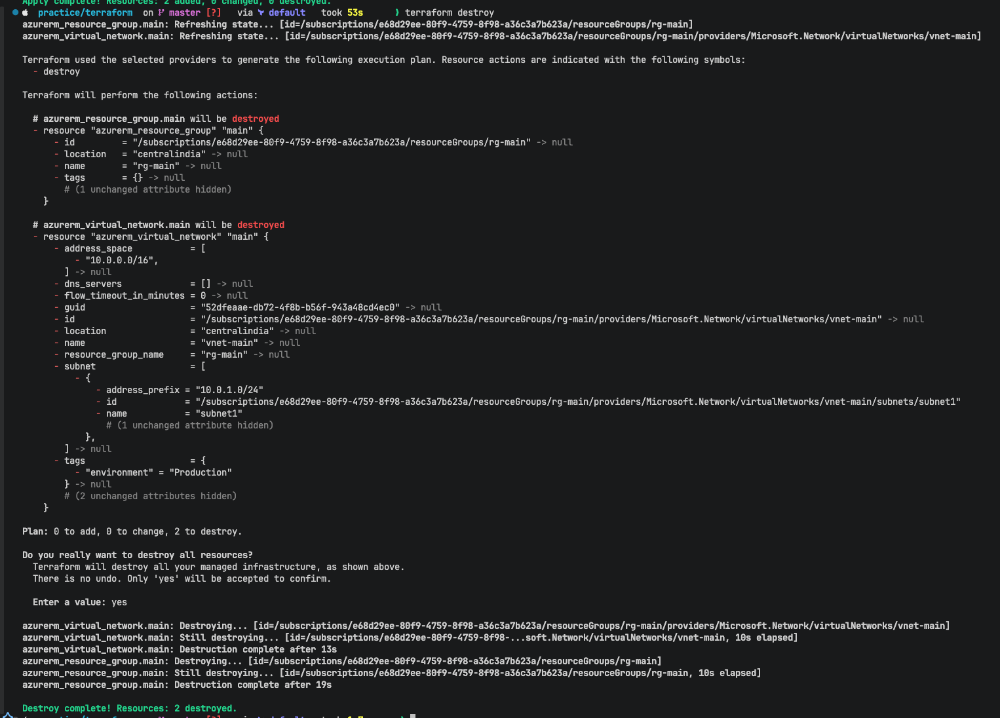
---

### 4. Create Cloud Resource (Azure) + Add Another Resource
- Created an initial resource
- Added a second resource to the configuration.
- Ran `terraform plan` to preview changes before applying.
- Applied with `terraform apply`.
- Destroyed with `terraform destroy`.


> 📸 Screenshot: 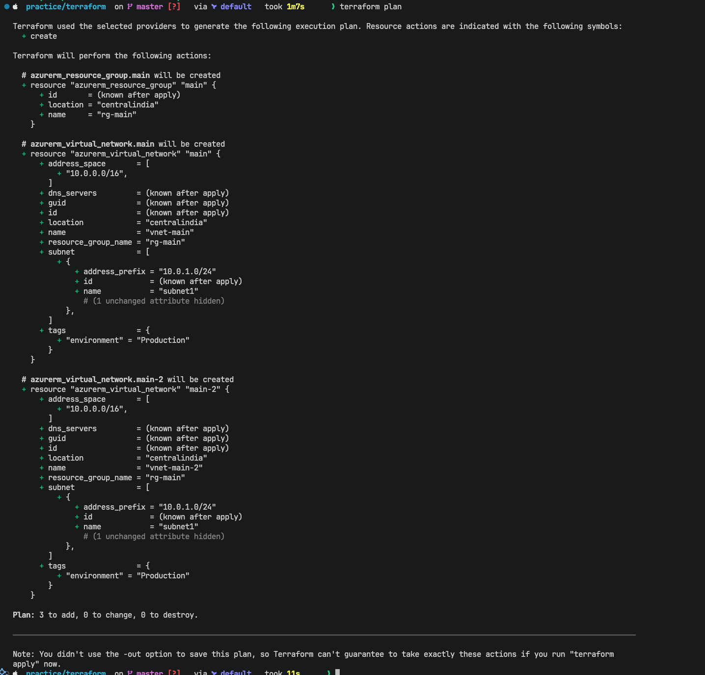
> 📸 Screenshot: 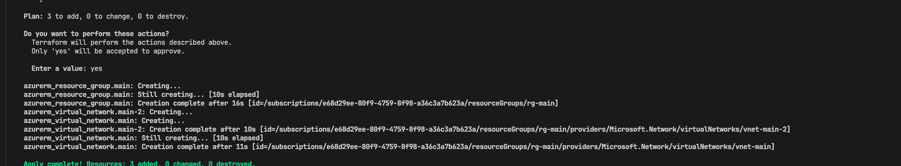

---

### 5. Change Resource Value & Verify Update
- Modified a value in the existing resource (change in tag from production to test ).
- Ran `terraform plan` to see what would change.
- Applied to confirm the change was reflected.


> 📸 Screenshot: 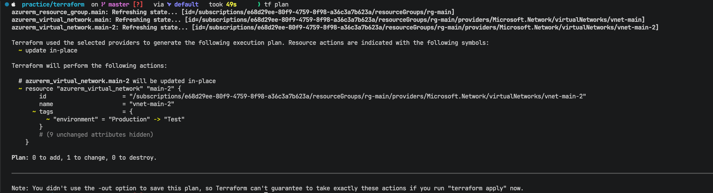

---

### 6. `terraform refresh` vs `terraform plan`

| Command | What it does |
|---|---|
| `terraform refresh` | Syncs the **state file** with actual cloud infrastructure (does NOT change resources) |
| `terraform plan` | Shows what changes **will be made** to match config with state |

**Key Insight:** `terraform refresh` updates your local state to match reality; `terraform plan` compares your config against the (possibly refreshed) state.


> 📸 Screenshot: current subnet in the cloud: 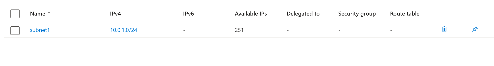
> 📸 Screenshot: current subnet in the tfstate file: 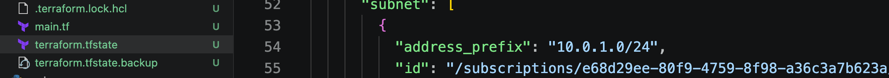
> 📸 Screenshot: changed the subnet in the cloud form 24 -> 27: 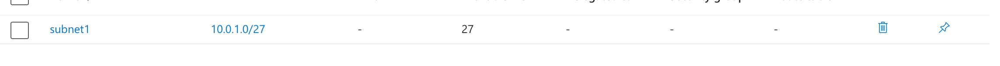
> 📸 Screenshot: As I did tf refresh subnet in the tfstate file changes automatically: 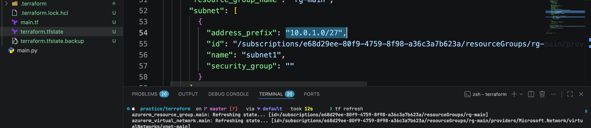
---

### 7. Extra Commands Explored

```bash
terraform validate   # Checks config syntax without connecting to provider
```
> 📸 Screenshot: 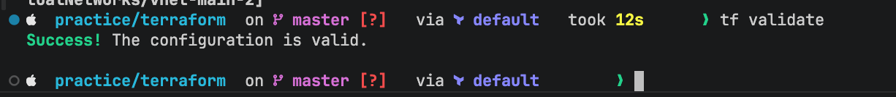

```bash
terraform fmt        # Auto-formats .tf files to standard style
terraform show       # Displays current state or a saved plan
```
> 📸 Screenshot: 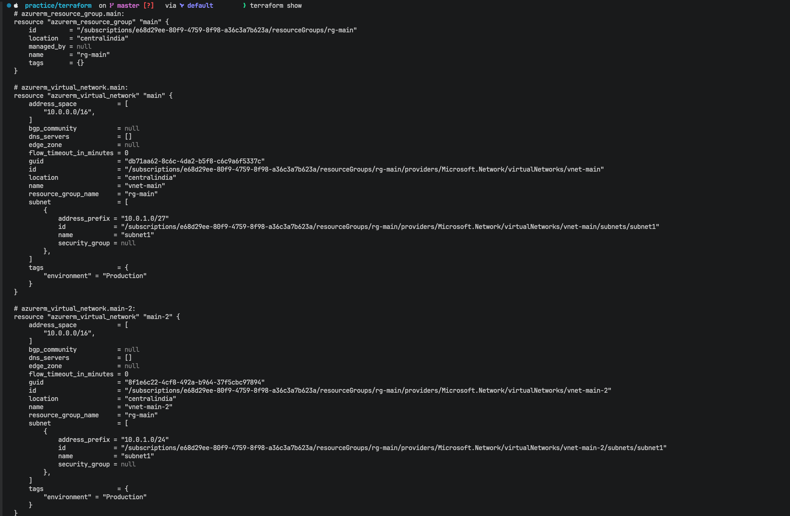

```bash
terraform state list # Lists all resources tracked in state
```
> 📸 Screenshot: 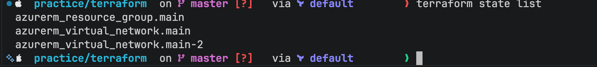


---

## 💡 Key Learnings Today

- Terraform uses a **declarative approach** — you define *what* you want, not *how* to get there.
- The **state file** (`terraform.tfstate`) is critical — it tracks real-world resource mapping.
- `terraform plan` is your best friend before every `apply` — always review changes.
- `terraform fmt` keeps code clean and consistent across teams.
- Destroying resources after testing on cloud saves costs!

---
