# Azure Networking Lab – Private Endpoint & Private DNS Zone (Portal)

End of Day (EOD) lab documenting how I secured an Azure Storage Account using:

- A Virtual Network with two subnets
- A Private Endpoint for Blob Storage
- An Azure Private DNS Zone
- A Linux VM to test **private-only** connectivity

The goal is: **Storage is not reachable from the public internet; only the VM in the VNet can access it via a private IP.**

---

## 💡 Architecture Overview

**Resources**

- **Resource Group**: `rg-private-endpoint-lab`
- **Virtual Network**: `vnet-lab` (`10.0.0.0/16`)
  - `subnet-vm` – `10.0.0.0/24` (Linux VM)
  - `subnet-pe` – `10.0.1.0/24` (Private Endpoint)
- **Storage Account**: `nihar123` (Standard LRS, public network access **disabled**)
- **Private Endpoint**: `pe-storage` (`blob` sub-resource, private IP e.g. `10.0.1.4`)
- **Private DNS Zone**: `privatelink.blob.core.windows.net`
- **Linux VM**: `vm-lab-linux` in `subnet-vm` with a public IP for SSH

**Traffic flow**

Laptop → SSH → `vm-lab-linux`  
`vm-lab-linux` → `nihar123.blob.core.windows.net` → resolves to `10.0.1.4`  
`10.0.1.4` (Private Endpoint) → Storage Account `nihar123` over Azure backbone

 
> Screenshot: 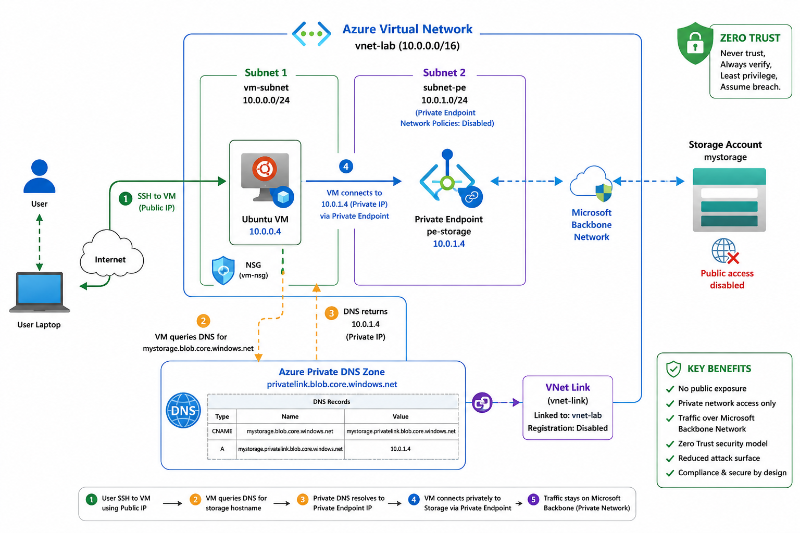

---

## ✅ Prerequisites

- Azure subscription (Azure for Students)
- Access to the Azure portal
- SSH client (I used macOS terminal)
- Region that is allowed by subscription (e.g. **Central India**)

Cost controls:

- VM size: `Standard_B1s`
- Storage redundancy: `LRS`
- Deleted the resource group after the lab

---

## 1. Create Resource Group & Virtual Network

### 1.1 Resource Group

1. **Resource groups** → **Create**
2. Resource group: `rg-private-endpoint-lab`
3. Region: `Central India`
4. **Review + create** → **Create**

> Screenshot: 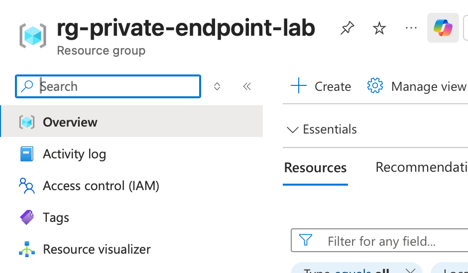

### 1.2 Virtual Network with Two Subnets

1. **Virtual networks** → **Create**
2. Basics:
   - RG: `rg-private-endpoint-lab`
   - Name: `vnet-lab`
   - Region: same as RG
3. IP addresses:
   - Address space: `10.0.0.0/16`
   - Remove default subnet

**Add `subnet-vm`**

- Name: `subnet-vm`
- Address range: `10.0.0.0/24`

> Screenshot: 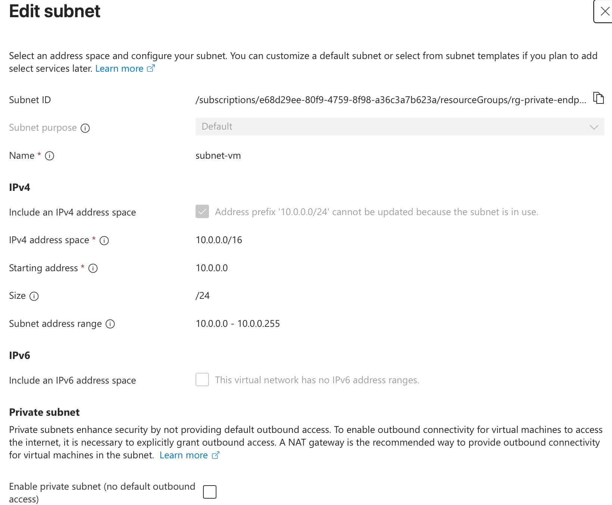

**Add `subnet-pe`**

- Name: `subnet-pe`
- Address range: `10.0.1.0/24`
- Expand **Private endpoint network policies** → set **Disabled**

> Screenshot: 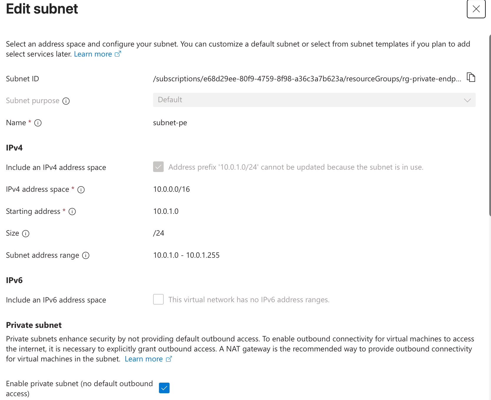

**Why two subnets?**

- `subnet-vm` hosts the VM and can have a public IP.
- `subnet-pe` only hosts Private Endpoints; network policies for PEs are disabled and no VMs live here.

---

## 2. Create Storage Account (Public Access Disabled)

1. **Storage accounts** → **Create**
2. Basics:
   - RG: `rg-private-endpoint-lab`
   - Name: `nihar123` (must be globally unique)
   - Region: same as `vnet-lab`
   - Performance: Standard
   - Redundancy: LRS
3. Networking:
   - Network access: **Disable public access and use private access**
4. **Review + create** → **Create**

> Screenshot: 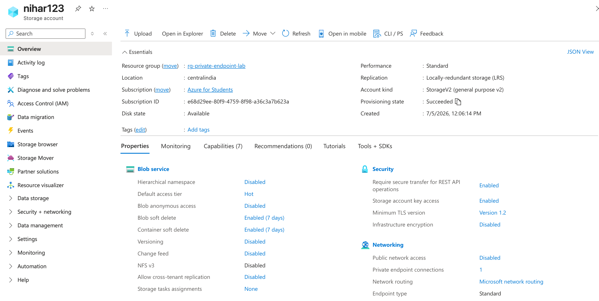


At this point the storage account cannot be reached from the public internet.

---

## 3. Create Private Endpoint for Blob

### 3.1 Start Private Endpoint Wizard

1. Open Storage Account `nihar123`
2. **Networking** → **Private endpoint connections** tab
3. **+ Private endpoint**

> Screenshot: 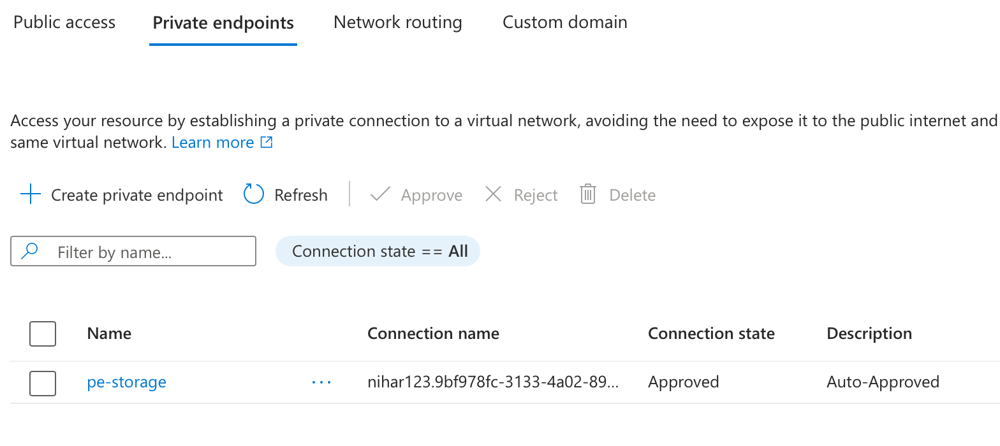

### 3.2 Basics

- Name: `pe-storage`
- Region: same as storage account
- RG: `rg-private-endpoint-lab`

### 3.3 Resource

- Connection method: connect to a resource in my directory
- Resource type: `Microsoft.Storage/storageAccounts`
- Resource: `nihar123`
- Target sub-resource: **blob**

### 3.4 Virtual Network

- Virtual network: `vnet-lab`
- Subnet: `subnet-pe`

### 3.5 DNS Integration

- Integrate with private DNS zone: **Yes**
- Private DNS Zone: `privatelink.blob.core.windows.net`

**Review + create** → **Create**

> Screenshot: 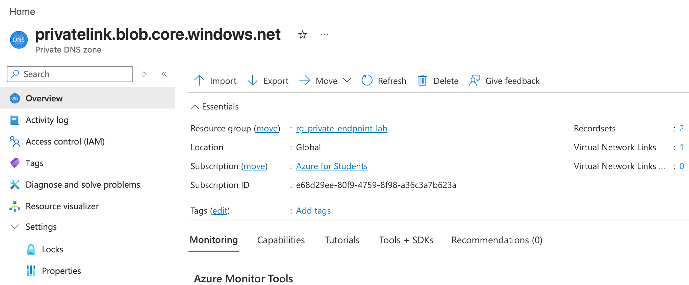

### 3.6 Get Private Endpoint IP

1. Open `pe-storage`
2. Click the **Network interface** (`pe-storage-nic`)
3. Go to **IP configurations** and note the **Private IP** (e.g. `10.0.1.4`)

> Screenshot: 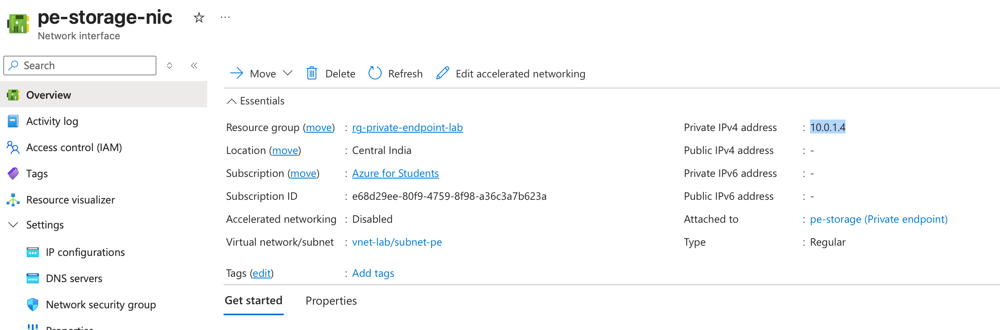

This IP is now the *private* address of `nihar123` inside the VNet.

---

## 4. Verify Private DNS Zone

### 4.1 Zone and VNet Link

1. **Private DNS zones** → open `privatelink.blob.core.windows.net`
2. **Virtual network links** → confirm link to `vnet-lab` with Status = **Completed**

> Screenshot: `screenshots/10-vnet-link.png`

### 4.2 A Record

1. In the same zone, open **Record sets**
2. Confirm there is an **A** record:
   - Name: `nihar123`
   - IP: `10.0.1.4`

> Screenshot: 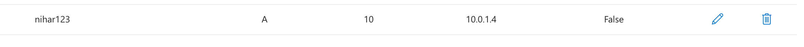

This ensures VMs in `vnet-lab` resolve `nihar123.blob.core.windows.net` to the private endpoint.

---

## 5. Deploy Test Linux VM

1. **Virtual machines** → **Create** → *Azure virtual machine*
2. Basics:
   - RG: `rg-private-endpoint-lab`
   - Name: `vm-lab-linux`
   - Region: same as VNet
   - Image: Ubuntu Server 22.04 LTS
   - Size: `Standard_B1s`
   - Auth: SSH public key
   - Username: `azureuser`
3. Networking:
   - VNet: `vnet-lab`
   - Subnet: `subnet-vm`
   - Public IP: enabled
   - Inbound ports: **SSH (22)**


**Create** and download the SSH private key if needed.

---

## 6. Test Private Connectivity from VM

### 6.1 SSH into VM

```bash
ssh -i <path-to-private-key> azureuser@<VM_PUBLIC_IP>
```

> Screenshot: `screenshots/13-ssh-connection.png`

### 6.2 DNS Resolution Test

Install DNS tools and resolve the storage account:

```bash
sudo apt-get update
sudo apt-get install -y dnsutils

nslookup nihar123.blob.core.windows.net
```

Expected:

- CNAME to `nihar123.privatelink.blob.core.windows.net`
- Address: `10.0.1.4`

> Screenshot: 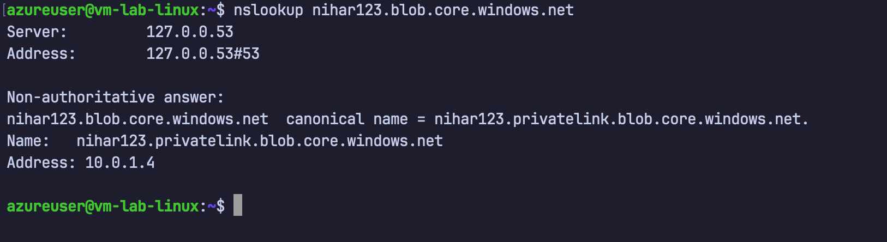

### 6.3 Install Azure CLI and Login

```bash
curl -sL https://aka.ms/InstallAzureCLIDeb | sudo bash
az login --use-device-code
```


### 6.4 Create Container and Upload Blob (via Private Endpoint)

```bash
az storage container create \
  --name test-container \
  --account-name nihar123 \
  --auth-mode login

echo "Hello Private Endpoint!" > testfile.txt

az storage blob upload \
  --account-name nihar123 \
  --container-name test-container \
  --name testfile.txt \
  --file testfile.txt \
  --auth-mode login
```

> Screenshot: 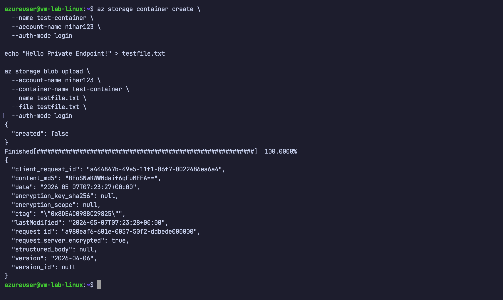

If you get a permissions error, see the next section.

---

## 7. Fix RBAC for Blob Data (If Needed)

If Azure CLI shows:

> You do not have the required permissions … `Storage Blob Data Contributor` …

then assign a data-plane role:

1. Open Storage Account `nihar123`
2. **Access control (IAM)** → **+ Add** → **Add role assignment**
3. Role: **Storage Blob Data Contributor**
4. Assign to: your user account
5. **Review + assign**, wait 1–2 minutes, and retry the upload

> Screenshot: 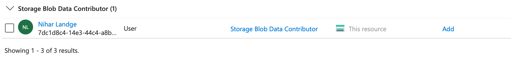
---


## 🔍 Key Takeaways

- **Private Endpoint** gives the storage account a private IP inside the VNet.
- **Private DNS Zone** maps the standard hostname to that private IP (no code changes).
- **Public network access disabled** means the service is private-only.
- **Two subnets**:
  - `subnet-vm`: VM with public IP for SSH.
  - `subnet-pe`: private endpoint only, PE network policies disabled.
- **RBAC separation**:
  - Management plane: `Contributor` (create/configure resources)
  - Data plane: `Storage Blob Data Contributor` (read/write blob data)

This repo documents an end-to-end Azure networking scenario aligned with Zero Trust: identity, network isolation, and data access controlled together.