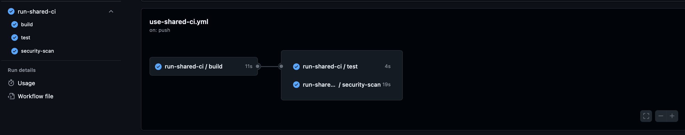
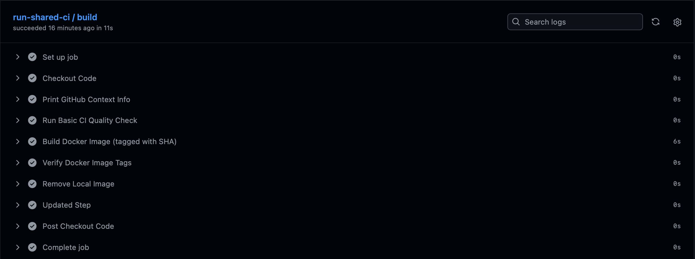
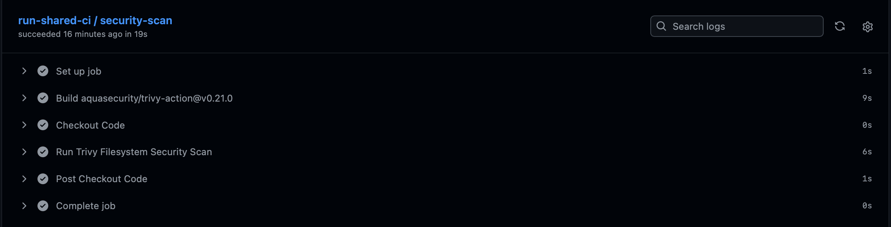
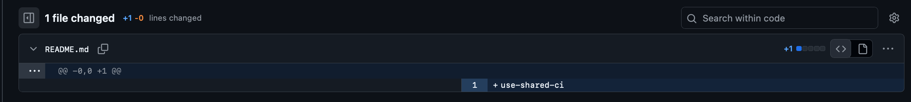
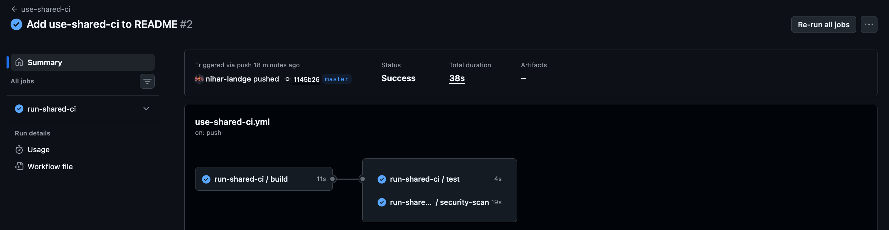
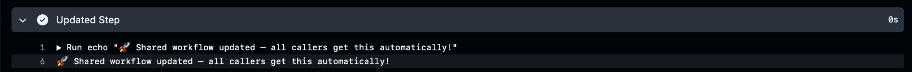

# Day 4 — GitHub Shared Workflows

## 📌 What Are Shared Workflows?
Shared Workflows let you store one CI workflow in a central repository
and reuse it across multiple projects. Update once → all projects get the update.

---

## 🗂️ Repository Setup

Two repositories are needed:


| Repository | Purpose |
|---|---|
| `shared-workflows` | Stores the reusable workflow |
| `demo-project` | Calls the shared workflow |

---

## Task 1 — Create Shared Workflow

**Repo:** [`shared-workflows`](https://github.com/nihar-landge/shared-workflows)  
**File:** [`.github/workflows/shared-ci.yml`](https://github.com/nihar-landge/shared-workflows/blob/master/.github/workflows/shared-ci.yml)

```yaml
name: shared-ci-quality-check

on:
  workflow_call:

jobs:
  build:
    runs-on: ubuntu-latest
    steps:
      - uses: actions/checkout@v4
      - name: Run Basic CI Check
        run: echo "Running Shared CI Quality Check"
      - name: Print GitHub Context
        run: |
          echo "Triggered by : ${{ github.actor }}"
          echo "Branch       : ${{ github.ref }}"
          echo "Commit SHA   : ${{ github.sha }}"
      - name: Build Docker Image
        run: docker build -t demo-app:${{ github.sha }} .

  test:
    runs-on: ubuntu-latest
    needs: build
    steps:
      - uses: actions/checkout@v4
      - run: echo "Tests passed!"

  security-scan:
    runs-on: ubuntu-latest
    needs: build
    steps:
      - uses: actions/checkout@v4
      - uses: aquasecurity/trivy-action@0.20.0
        with:
          scan-type: fs
          severity: HIGH,CRITICAL


## ✅ Task 2 — Call Shared Workflow from Another Repo

```yaml
name: use-shared-ci

on:
  push:
  pull_request:
  workflow_dispatch:

jobs:
  run-shared-ci:
    uses: nihar-landge/shared-workflows/.github/workflows/shared-ci.yml@master
```

📸 Screenshots:








## ✅ Task 3 — Modify Shared Workflow & Observe Impact

In [shared-workflows/shared-ci.yml](https://github.com/nihar-landge/shared-workflows/blob/master/.github/workflows/shared-ci.yml), add this step inside the build job:

```yaml
      - name: Updated Step
        run: echo "Shared workflow updated!"
```

Push the change to shared-workflows.  
Then push any small commit to demo-project (e.g., edit README).

📸 Screenshots:







