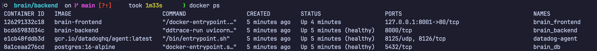
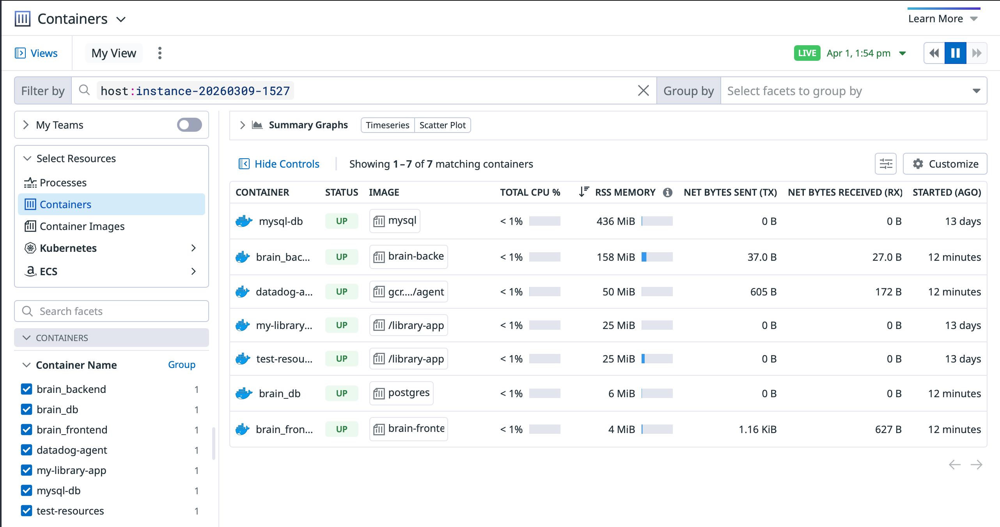

# Datadog Setup Guide

This guide documents the exact setup used in this repo for Datadog infrastructure monitoring, logs, and Python APM traces.

Use this when setting up a new environment so you can complete Datadog integration end-to-end without guessing.

## What this setup covers

- Datadog Agent as a Docker service
- Container logs and host/container metrics
- FastAPI backend APM tracing through `ddtrace`
- CI/CD secret injection for `DD_API_KEY`
- Verification and troubleshooting commands

## 1) Prerequisites

- A Datadog account
- A Datadog API key
- Correct Datadog site for your org (this repo uses `us5.datadoghq.com`)
- Docker and Docker Compose on the deployment host

## 2) Backend tracing changes

### A. Add `ddtrace` dependency

File: `backend/requirements.txt`

```txt
ddtrace>=2.8.0
```

### B. Run backend through `ddtrace-run`

File: `docker/Dockerfile.backend`

```dockerfile
CMD ["ddtrace-run", "uvicorn", "main:app", "--host", "0.0.0.0", "--port", "8000"]
```

This is what enables automatic tracing of FastAPI requests and database calls.

## 3) Docker Compose changes

File: `docker-compose.yml`

### A. Add Datadog env vars to backend service

```yaml
backend:
  environment:
    - DD_AGENT_HOST=datadog-agent
    - DD_ENV=production
    - DD_SERVICE=brain-backend
    - DD_VERSION=1.0.0
```

### B. Add `datadog-agent` service

```yaml
datadog-agent:
  image: gcr.io/datadoghq/agent:latest
  container_name: datadog-agent
  environment:
    - DD_API_KEY=${DD_API_KEY:-}
    - DD_SITE=us5.datadoghq.com
    - DD_ENV=production
    - DD_LOGS_ENABLED="true"
    - DD_LOGS_CONFIG_CONTAINER_COLLECT_ALL="true"
    - DD_APM_ENABLED="true"
    - DD_APM_NON_LOCAL_TRAFFIC="true"
  volumes:
    - /var/run/docker.sock:/var/run/docker.sock:ro
    - /proc/:/host/proc/:ro
    - /sys/fs/cgroup/:/host/sys/fs/cgroup:ro
  networks:
    - brain_net
  restart: unless-stopped
```

Why these mounts matter:

- `/var/run/docker.sock`: container discovery and container log collection
- `/proc` and `/sys/fs/cgroup`: host/container CPU, memory, and process metrics

## 4) CI/CD changes (GitHub Actions)

File: `.github/workflows/deploy.yml`

### A. Export Datadog secret before compose commands

```bash
export DD_API_KEY="${{ secrets.DD_API_KEY }}"
```


## 5) GitHub secrets required

Repository secrets needed for Datadog path:

- `DD_API_KEY`

If this is missing or empty, the agent cannot authenticate with Datadog.

## 6) Deploy

Push to `main` (or run workflow manually). Deployment should recreate services and bring up `datadog-agent`.

## 7) Verify after deployment

Run on server:

```bash
docker ps
```

Expected: `datadog-agent` appears and is healthy/running.

Then:

```bash
docker compose config --services
```

Expected: list includes `datadog-agent`.

Check agent health/status:

```bash
docker logs datadog-agent --tail 100
docker exec datadog-agent agent status
```

## 8) Screenshots

### Logs


### APM


